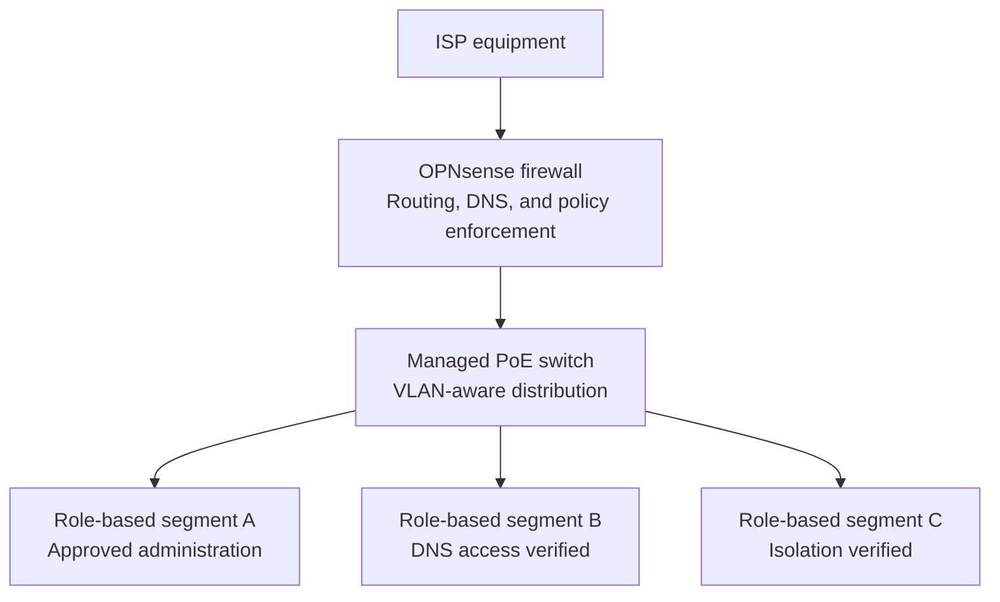
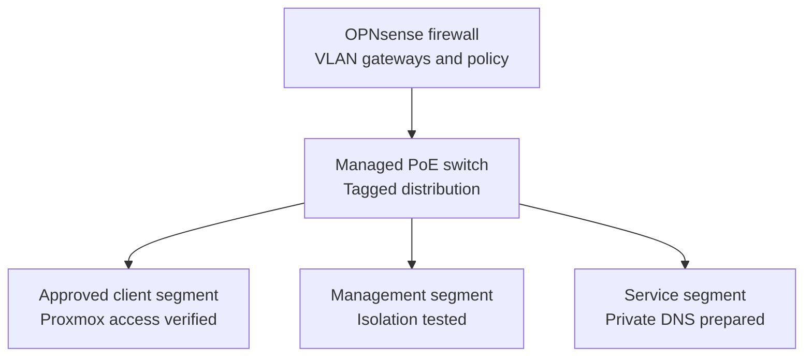
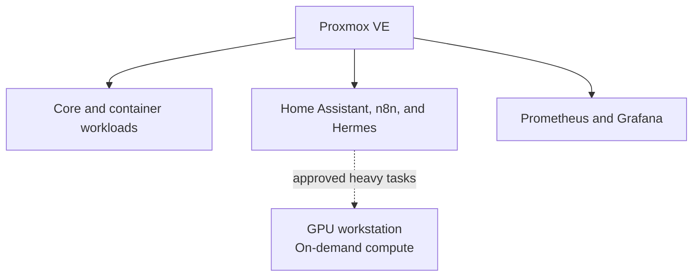

# HomeLab Architecture

> **Last verified:** August 2026  
> **Project status:** Work in progress

This document describes the HomeLab at two different levels:

1. The **current verified state**, which includes only components that are installed or confirmed to be available.
2. The **target architecture**, which represents the intended direction of the project and must not be interpreted as already deployed.

The diagrams intentionally omit real addresses, internal hostnames, wireless network names, remote-access endpoints, firewall rules, credentials, and hardware identifiers.

## Current Verified State

The dedicated OPNsense appliance provides the firewall, routing, and VLAN gateway layer for the HomeLab. Its upstream connection remains behind the existing ISP equipment, while its internal connection feeds the managed PoE switch. OPNsense has been updated to `26.7.2_2`, and internet and DNS connectivity have been verified after the network changes.

The managed switch is running firmware `3.30.6`, its local administration is accessible, and three role-based VLANs are active. The Proxmox host was migrated to its segmented management path and remains reachable from an approved client segment. Initial DNS-access and cross-segment isolation policies have been applied and tested. Private name resolution has also been prepared for the first planned service workload. Final private network-configuration backups have been saved and verified. No complete service workload is presented as operational.

### Verified Components

| Layer | Component | Verified state |
| --- | --- | --- |
| Physical | 12U rack and rack accessories | Assembled; the base network path is connected and final cable organization is in progress. |
| Compute | GMKtec virtualization host | Proxmox VE is installed, updated, accessible through its segmented management path, and protected with a separate administrative account and multi-factor authentication. |
| Storage | Proxmox local storage | An operating system ISO has been uploaded. |
| Virtualization | Virtual machines | The network and private name-resolution foundation for the first planned service VM is prepared; no complete service workload is presented as operational. |
| Edge security | Dedicated Intel N100 appliance | OPNsense `26.7.2_2` is installed; routing, DHCP, DNS, internet access, local administration, segmented access, and initial cross-segment policy enforcement have been verified. |
| Switching | TP-Link managed PoE switch | Firmware `3.30.6` is installed; private management, traffic forwarding, and three role-based VLANs are operational. |
| Services | Home automation, monitoring, containers, and AI services | Not deployed. |

## Verified Network Segmentation

OPNsense remains the firewall, routing, DNS, and policy-enforcement layer, while the managed switch transports the segmented network to approved devices. Three VLANs have been deployed and preserved through the final update and validation cycle. Initial rules allow required DNS and approved administrative access while blocking tested cross-segment paths that are not required. Public labels are deliberately generic and do not reveal live VLAN identifiers, addressing, port assignments, or policy details.

VLAN transport, approved Proxmox reachability, internet access, segment-specific DNS access, and selected isolation paths have been verified. These tests establish an initial least-privilege policy baseline; a complete policy review, VPN access, and workload-level isolation remain future work.

## Target Logical Architecture

Proxmox VE will remain the always-available virtualization layer. Future workloads will be separated by role so that infrastructure, automation, observability, and experimental services can be maintained and documented independently.

All workloads in this diagram are **planned**. Their final VM or container placement, resource allocation, network access, and backup strategy will be decided and documented during deployment.

The GPU-equipped primary workstation is not intended to be permanently dedicated to Hermes or other HomeLab services. The target design treats it as an on-demand compute node for approved heavy local-AI tasks. When the workstation is off, an authorized automation may request Wake-on-LAN; automatic suspension or shutdown after an automated task will be evaluated later. The GPU must remain available for interactive workloads such as streaming and must not be consumed merely because the computer is powered on.

## Planned Functional Layers

| Layer | Planned role | Current status |
| --- | --- | --- |
| Edge and routing | OPNsense routing, firewalling, VLAN gateways, and controlled remote access | Operational segmented foundation with initial DNS and isolation policies verified; comprehensive policy review and remote access remain pending. |
| Network distribution | Managed switching and role-based segmentation | Traffic forwarding, private management, firmware, and three VLANs are operational. |
| Virtualization | Linux virtual machines and isolated service workloads | Proxmox installed, updated, and hardened; network and private name resolution prepared for the first service workload, while complete guest deployment remains pending. |
| Containers | Reproducible deployment of selected services | Planned. |
| Home automation | Home Assistant and local voice interfaces | Planned; hardware is available. |
| Observability | Metrics and dashboards with Prometheus and Grafana | Planned. |
| Assistant platform | Persistent local assistant using Hermes Agent | Planned. |
| AI compute | Heavy local inference on the GPU-equipped workstation | Planned as an on-demand node; Wake-on-LAN and workload controls are not yet integrated. |
| Storage and backups | Network configuration, future NAS, service backups, and recovery procedures | Final private network-configuration backups are verified; service and storage design remains planned. |

## Architecture Principles

The project will follow these principles as it evolves:

- **Verified documentation:** deployed and planned components are always identified separately.
- **Least privilege:** services should receive only the access needed for their role.
- **Separation of responsibilities:** firewalling, virtualization, automation, monitoring, and experimental workloads should remain logically distinct.
- **Safe changes:** major network changes should be tested before becoming the primary network path.
- **Reproducibility:** relevant deployment steps and sanitized example configurations should be documented.
- **Observability:** important services should eventually expose health and performance information without publishing sensitive operational data.
- **Recoverability:** private network-configuration backups are retained, while restoration procedures must continue to be reviewed and tested before services are treated as dependable.
- **Privacy by design:** public documentation must not reveal details that could identify or weaken the live environment.

## Future Documentation

The existing physical-setup, Proxmox, network-design, roadmap, and changelog documents will be updated as milestones are verified. New implementation records will be added only after the corresponding work is completed. Planned topics include:

- First-VM deployment notes
- Segmentation policy refinement and recovery-validation notes
- Service deployment records
- Monitoring, backup, and recovery procedures

## Public Documentation Boundaries

Future diagrams and examples will use descriptive labels and documentation-only values. The public repository will not include:

- Real public or private IP addresses
- Internal DNS names or Wi-Fi identifiers
- MAC addresses, serial numbers, or device labels
- Credentials, tokens, private keys, certificates, or recovery codes
- Complete firewall exports or backup files
- Remote-access endpoints
- Camera streams, access details, or private physical-layout information

These boundaries allow the project to demonstrate architecture and operational knowledge without exposing the live HomeLab.
