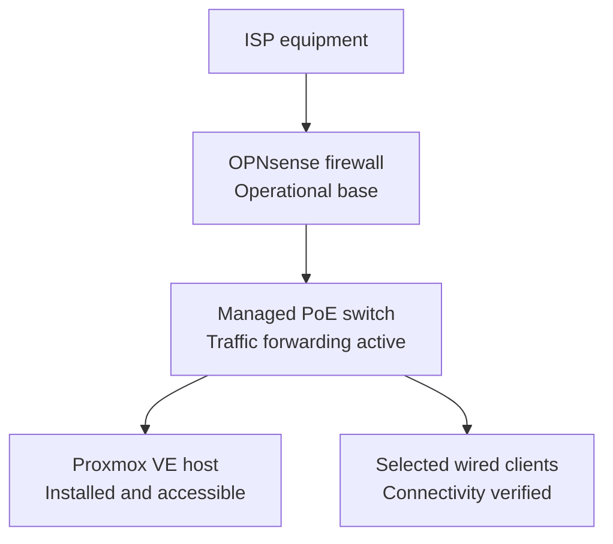
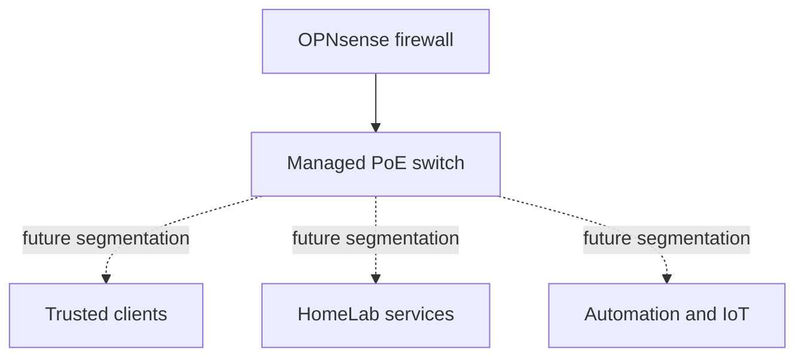
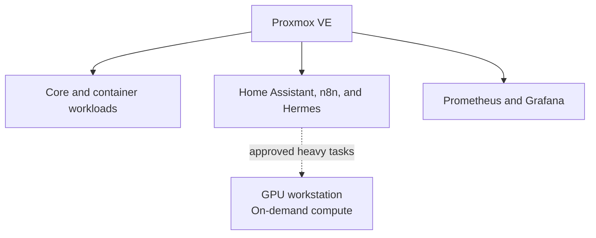

# HomeLab Architecture

> **Last verified:** August 2026  
> **Project status:** Work in progress

This document describes the HomeLab at two different levels:

1. The **current verified state**, which includes only components that are installed or confirmed to be available.
2. The **target architecture**, which represents the intended direction of the project and must not be interpreted as already deployed.

The diagrams intentionally omit real addresses, internal hostnames, wireless network names, remote-access endpoints, firewall rules, credentials, and hardware identifiers.

## Current Verified State

The dedicated OPNsense appliance now provides the firewall and routing layer for the HomeLab LAN. Its upstream connection remains behind the existing ISP equipment, while its internal connection feeds the managed PoE switch. Selected wired devices, including the Proxmox host and an administration client, have been tested successfully through this path.

The managed switch is currently forwarding traffic, but its administrative setup, firmware review, and future segmentation remain pending. No complete virtual machine or self-hosted service has been deployed.

### Verified Components

| Layer | Component | Verified state |
| --- | --- | --- |
| Physical | 12U rack and rack accessories | Assembled; the base network path is connected and final cable organization is in progress. |
| Compute | GMKtec virtualization host | Proxmox VE is installed, updated, accessible through the HomeLab LAN, and protected with a separate administrative account and multi-factor authentication. |
| Storage | Proxmox local storage | An operating system ISO has been uploaded. |
| Virtualization | Virtual machines | No complete VM has been created and booted. |
| Edge security | Dedicated Intel N100 appliance | OPNsense is installed; initial WAN, LAN, DHCP, DNS, internet-access, and local-administration checks have been completed. |
| Switching | TP-Link managed PoE switch | Connected and forwarding HomeLab traffic; managed setup and segmentation remain pending. |
| Services | Home automation, monitoring, containers, and AI services | Not deployed. |

## Next Network Stage

The next network stage will keep OPNsense as the firewall and routing layer while turning the switch from a basic forwarding point into a deliberately managed distribution layer. Segmentation will be introduced only after switch access, firmware, management settings, rollback access, and the unsegmented base network have been verified.

This is a target design. VLANs, inter-network firewall policy, VPN access, and service isolation are not currently deployed.

## Target Logical Architecture

Proxmox VE will remain the always-available virtualization layer. Future workloads will be separated by role so that infrastructure, automation, observability, and experimental services can be maintained and documented independently.

All workloads in this diagram are **planned**. Their final VM or container placement, resource allocation, network access, and backup strategy will be decided and documented during deployment.

The GPU-equipped primary workstation is not intended to be permanently dedicated to Hermes or other HomeLab services. The target design treats it as an on-demand compute node for approved heavy local-AI tasks. When the workstation is off, an authorized automation may request Wake-on-LAN; automatic suspension or shutdown after an automated task will be evaluated later. The GPU must remain available for interactive workloads such as streaming and must not be consumed merely because the computer is powered on.

## Planned Functional Layers

| Layer | Planned role | Current status |
| --- | --- | --- |
| Edge and routing | OPNsense routing, firewalling, and controlled remote access | Operational base; advanced policy and remote access remain pending. |
| Network distribution | Managed switching and future segmentation | Traffic forwarding is active; management and segmentation remain pending. |
| Virtualization | Linux virtual machines and isolated service workloads | Proxmox installed, updated, and hardened; guest deployment pending. |
| Containers | Reproducible deployment of selected services | Planned. |
| Home automation | Home Assistant and local voice interfaces | Planned; hardware is available. |
| Observability | Metrics and dashboards with Prometheus and Grafana | Planned. |
| Assistant platform | Persistent local assistant using Hermes Agent | Planned. |
| AI compute | Heavy local inference on the GPU-equipped workstation | Planned as an on-demand node; Wake-on-LAN and workload controls are not yet integrated. |
| Storage and backups | Future NAS, service backups, and recovery procedures | Planned; final design not selected. |

## Architecture Principles

The project will follow these principles as it evolves:

- **Verified documentation:** deployed and planned components are always identified separately.
- **Least privilege:** services should receive only the access needed for their role.
- **Separation of responsibilities:** firewalling, virtualization, automation, monitoring, and experimental workloads should remain logically distinct.
- **Safe changes:** major network changes should be tested before becoming the primary network path.
- **Reproducibility:** relevant deployment steps and sanitized example configurations should be documented.
- **Observability:** important services should eventually expose health and performance information without publishing sensitive operational data.
- **Recoverability:** configuration backups and restoration procedures will be added before services are treated as dependable.
- **Privacy by design:** public documentation must not reveal details that could identify or weaken the live environment.

## Future Documentation

The existing physical-setup, Proxmox, network-design, roadmap, and changelog documents will be updated as milestones are verified. New implementation records will be added only after the corresponding work is completed. Planned topics include:

- First-VM deployment notes
- Managed-switch setup and safe network-segmentation implementation
- Service deployment records
- Monitoring, backup, and recovery procedures

## Public Documentation Boundaries

Future diagrams and examples will use descriptive labels and documentation-only values. The public repository will not include:

- Real public or private IP addresses
- Internal DNS names or Wi-Fi identifiers
- MAC addresses, serial numbers, or device labels
- Credentials, tokens, private keys, certificates, or recovery codes
- Complete firewall exports or backup files
- Remote-access endpoints
- Camera streams, access details, or private physical-layout information

These boundaries allow the project to demonstrate architecture and operational knowledge without exposing the live HomeLab.
