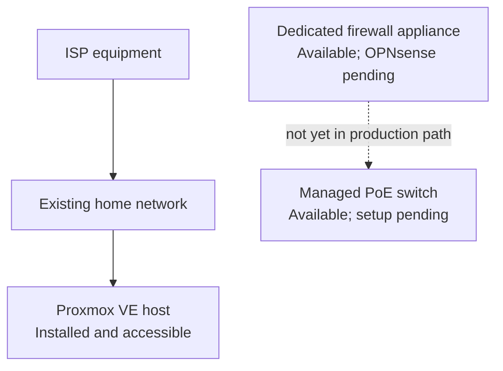
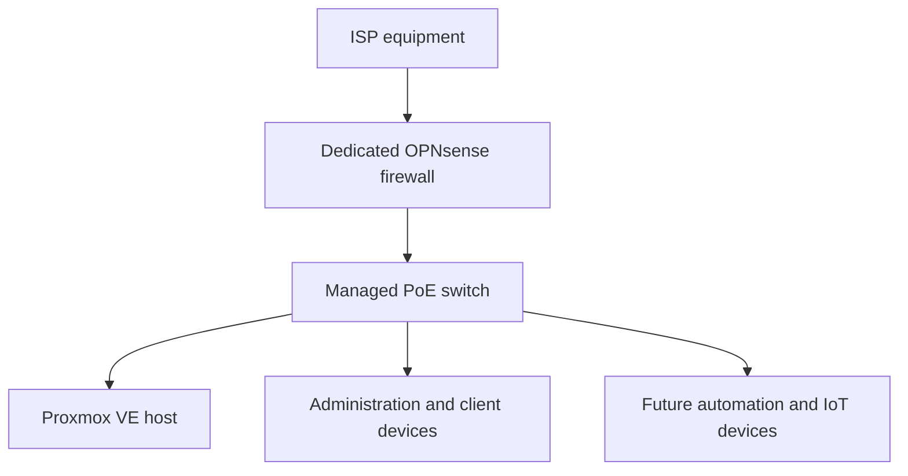
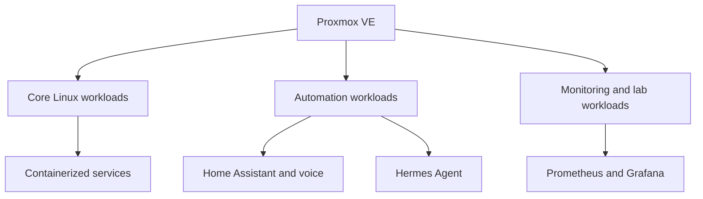

# HomeLab Architecture

> **Last verified:** August 2026  
> **Project status:** Work in progress

This document describes the HomeLab at two different levels:

1. The **current verified state**, which includes only components that are installed or confirmed to be available.
2. The **target architecture**, which represents the intended direction of the project and must not be interpreted as already deployed.

The diagrams intentionally omit real addresses, internal hostnames, wireless network names, remote-access endpoints, firewall rules, credentials, and hardware identifiers.

## Current Verified State

At the time of this update, the existing home network remains responsible for normal connectivity. The Proxmox host is installed and its management interface has been reached successfully through the existing network.

The dedicated firewall appliance and managed switch are physically available, but they are not yet operating as the production network path. No complete virtual machine or self-hosted service has been deployed.

### Verified Components

| Layer | Component | Verified state |
| --- | --- | --- |
| Physical | 12U rack and rack accessories | Assembled; final cabling is in progress. |
| Compute | GMKtec virtualization host | Proxmox VE is installed and web access has been verified. |
| Storage | Proxmox local storage | An operating system ISO has been uploaded. |
| Virtualization | Virtual machines | No complete VM has been created and booted. |
| Edge security | Dedicated Intel N100 appliance | Available with pfSense preinstalled; OPNsense migration is pending. |
| Switching | TP-Link managed PoE switch | Available; not yet connected or configured. |
| Services | Home automation, monitoring, containers, and AI services | Not deployed. |

## Target Physical and Network Architecture

The target design introduces a dedicated firewall between the ISP equipment and the managed switch. The switch will provide the main wired distribution point for the virtualization host and other approved network devices.

This is a target design. OPNsense, switch management, network segmentation, and production cutover remain pending and will be documented only after successful configuration and testing.

## Target Logical Architecture

Proxmox VE will remain the virtualization layer. Future workloads will be separated by role so that infrastructure, automation, observability, and experimental services can be maintained and documented independently.

All workloads in this diagram are **planned**. Their final VM or container placement, resource allocation, network access, and backup strategy will be decided and documented during deployment.

## Planned Functional Layers

| Layer | Planned role | Current status |
| --- | --- | --- |
| Edge and routing | OPNsense routing, firewalling, and controlled remote access | Planned; not installed or configured. |
| Network distribution | Managed switching and future segmentation | Planned; switch setup has not started. |
| Virtualization | Linux virtual machines and isolated service workloads | Proxmox installed; guest deployment pending. |
| Containers | Reproducible deployment of selected services | Planned. |
| Home automation | Home Assistant and local voice interfaces | Planned; hardware is available. |
| Observability | Metrics and dashboards with Prometheus and Grafana | Planned. |
| Assistant platform | Persistent local assistant using Hermes Agent | Planned. |
| AI compute | Optional workloads on the GPU-equipped workstation | Under evaluation; not integrated as a permanent node. |
| Storage and backups | Future NAS, service backups, and recovery procedures | Planned; final design not selected. |

## Architecture Principles

The project will follow these principles as it evolves:

- **Verified documentation:** deployed and planned components are always identified separately.
- **Least privilege:** services should receive only the access needed for their role.
- **Separation of responsibilities:** firewalling, virtualization, automation, monitoring, and experimental workloads should remain logically distinct.
- **Safe changes:** major network changes should be tested before becoming the primary network path.
- **Reproducibility:** relevant deployment steps and sanitized example configurations should be documented.
- **Observability:** important services should eventually expose health and performance information without publishing sensitive operational data.
- **Recoverability:** configuration backups and restoration procedures will be added before services are treated as dependable.
- **Privacy by design:** public documentation must not reveal details that could identify or weaken the live environment.

## Future Documentation

The architecture will be updated when each milestone is verified. Planned supporting documents include:

- Physical rack assembly and sanitized cabling documentation
- Proxmox VE installation and first-VM deployment notes
- OPNsense installation and initial validation
- Managed-switch setup and safe network-segmentation design
- Service deployment records
- Monitoring, backup, and recovery documentation
- A changelog recording completed milestones

## Public Documentation Boundaries

Future diagrams and examples will use descriptive labels and documentation-only values. The public repository will not include:

- Real public or private IP addresses
- Internal DNS names or Wi-Fi identifiers
- MAC addresses, serial numbers, or device labels
- Credentials, tokens, private keys, certificates, or recovery codes
- Complete firewall exports or backup files
- Remote-access endpoints
- Camera streams, access details, or private physical-layout information

These boundaries allow the project to demonstrate architecture and operational knowledge without exposing the live HomeLab.
