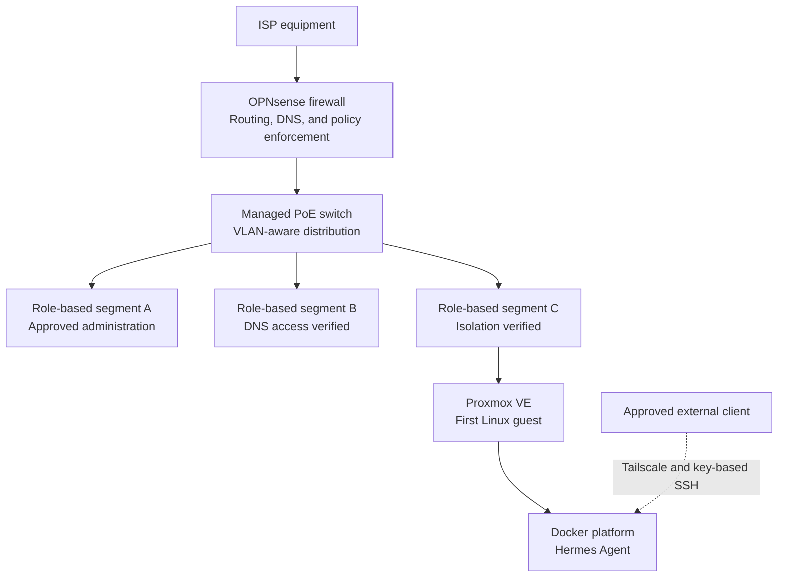
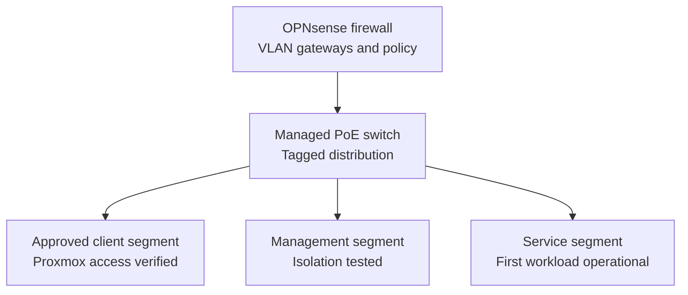

# HomeLab Architecture

> **Last verified:** September 2026  
> **Project status:** Work in progress

This document describes the HomeLab at two different levels:

1. The **current verified state**, which includes only components that are installed or confirmed to be available.
2. The **target architecture**, which represents the intended direction of the project and must not be interpreted as already deployed.

The diagrams intentionally omit real addresses, internal hostnames, wireless network names, remote-access endpoints, firewall rules, credentials, and hardware identifiers.

## Current Verified State

The dedicated OPNsense appliance provides the firewall, routing, and VLAN gateway layer for the HomeLab. Its upstream connection remains behind the existing ISP equipment, while its internal connection feeds the managed PoE switch. OPNsense has been updated to `26.7.2_2`, and internet and DNS connectivity have been verified after the network changes.

The managed switch is running firmware `3.30.6`, its local administration is accessible, and three role-based VLANs are active. The Proxmox host is running Proxmox VE `9.2.11`, remains reachable from an approved client segment, and hosts the first validated Linux service VM. Initial DNS-access and cross-segment isolation policies have been applied and tested. The guest uses private name resolution, key-based remote administration, and a validated Docker platform. Hermes Agent is deployed, and its persistent memory loading has been verified across sessions. Tailscale provides a private remote path from one approved external client to the Hermes host, and key-based SSH was verified outside the home network. Final private network-configuration backups have been saved and verified. Initial encrypted backups of the current VM and container workloads were copied to separate storage and verified with matching SHA-256 checksums. The encrypted virtual-machine workflow was later repeated successfully after further configuration changes, providing a newer integrity-verified recovery source while controlled restoration remains pending.

### Verified Components

| Layer | Component | Verified state |
| --- | --- | --- |
| Physical | 12U rack and rack accessories | Completed; equipment placement, physical cabling, private labeling, ventilation checks, and power-distribution review have been verified. |
| Compute | GMKtec virtualization host | Proxmox VE `9.2.11` is installed, updated, accessible through its segmented management path, and protected with a separate administrative account and multi-factor authentication. |
| Storage | Proxmox local storage | An operating system ISO has been uploaded. |
| Virtualization | Virtual machines | The first Ubuntu Server `24.04.4 LTS` guest is installed, updated, reachable, and hardened for key-based remote administration. |
| Edge security | Dedicated Intel N100 appliance | OPNsense `26.7.2_2` is installed; routing, DHCP, DNS, internet access, local administration, segmented access, and initial cross-segment policy enforcement have been verified. |
| Switching | TP-Link managed PoE switch | Firmware `3.30.6` is installed; private management, traffic forwarding, and three role-based VLANs are operational. |
| Containers | Docker Engine and Docker Compose | Docker Engine `29.7.2` and Docker Compose `5.5.0` are installed and validated on the first Linux guest. |
| Assistant | Hermes Agent | Deployed on the first guest; persistent memory loading has been verified in a new session. |
| Remote access | Tailscale private overlay | One approved external client can reach the Hermes host through a tested private path using the existing hardened SSH authentication. |
| Future services | Home automation, monitoring, and additional automation | Not deployed. |

## Verified Network Segmentation

OPNsense remains the firewall, routing, DNS, and policy-enforcement layer, while the managed switch transports the segmented network to approved devices. Three VLANs have been deployed and preserved through the final update and validation cycle. Initial rules allow required DNS and approved administrative access while blocking tested cross-segment paths that are not required. Public labels are deliberately generic and do not reveal live VLAN identifiers, addressing, port assignments, or policy details.

VLAN transport, approved Proxmox reachability, internet access, segment-specific DNS access, and selected isolation paths have been verified. A separate Tailscale overlay now provides tested remote access to the Hermes host from one approved client. These tests establish an initial least-privilege baseline; comprehensive policy review, broader remote administration, and workload-level isolation remain future work.

## Target Logical Architecture

Proxmox VE remains the always-available virtualization layer. The first Linux guest provides the validated container and Hermes Agent foundation. Future workloads will be separated by role so that home automation, observability, and experimental services can be maintained and documented independently.

```mermaid
flowchart TD
    PVE["Proxmox VE"] --> HERMES["Linux VM<br/>Docker and Hermes operational"]
    PVE --> AUTO["Home Assistant and n8n<br/>Planned"]
    PVE --> OBS["Prometheus and Grafana"]
    HERMES -. "future approved heavy tasks" .-> GPU["GPU workstation<br/>On-demand compute"]
```

Only the Linux VM, Docker platform, and Hermes Agent path is currently operational. The other workloads and the GPU integration remain planned; their placement, resource allocation, network access, and backup strategy will be decided and documented during deployment.

The GPU-equipped primary workstation is not intended to be permanently dedicated to Hermes or other HomeLab services. The target design treats it as an on-demand compute node for approved heavy local-AI tasks. When the workstation is off, an authorized automation may request Wake-on-LAN; automatic suspension or shutdown after an automated task will be evaluated later. The GPU must remain available for interactive workloads such as streaming and must not be consumed merely because the computer is powered on.

## Functional Layers

| Layer | Planned role | Current status |
| --- | --- | --- |
| Edge and routing | OPNsense routing, firewalling, VLAN gateways, and controlled remote access | Operational segmented foundation with initial DNS and isolation policies verified; comprehensive policy review and network-wide remote administration remain pending. |
| Remote access | Private access to selected services from approved external devices | Tailscale access to the Hermes host is operational and externally tested for one approved client; additional clients and policy refinement remain pending. |
| Network distribution | Managed switching and role-based segmentation | Traffic forwarding, private management, firmware, and three VLANs are operational. |
| Virtualization | Linux virtual machines and isolated service workloads | Proxmox VE `9.2.11` and the first hardened Ubuntu Server guest are operational. |
| Containers | Reproducible deployment of selected services | Docker Engine `29.7.2` and Docker Compose `5.5.0` are operational on the first guest. |
| Home automation | Home Assistant and local voice interfaces | Planned; hardware is available. |
| Observability | Metrics and dashboards with Prometheus and Grafana | Planned. |
| Assistant platform | Persistent local assistant using Hermes Agent | Operational initial deployment with cross-session memory loading verified. |
| AI compute | Heavy local inference on the GPU-equipped workstation | Planned as an on-demand node; Wake-on-LAN and workload controls are not yet integrated. |
| Storage and backups | Network configuration, workload backups, future NAS, and recovery procedures | Network-configuration copies and initial encrypted VM and container backups are verified. A later manual virtual-machine backup cycle also passed secondary-copy integrity validation; recurring rotation and controlled restoration remain pending. |

## Architecture Principles

The project will follow these principles as it evolves:

- **Verified documentation:** deployed and planned components are always identified separately.
- **Least privilege:** services should receive only the access needed for their role.
- **Separation of responsibilities:** firewalling, virtualization, automation, monitoring, and experimental workloads should remain logically distinct.
- **Safe changes:** major network changes should be tested before becoming the primary network path.
- **Reproducibility:** relevant deployment steps and sanitized example configurations should be documented.
- **Observability:** important services should eventually expose health and performance information without publishing sensitive operational data.
- **Recoverability:** private network-configuration and encrypted workload backups are retained and integrity-checked, while restoration procedures must still be tested before recovery is treated as dependable.
- **Privacy by design:** public documentation must not reveal details that could identify or weaken the live environment.

## Future Documentation

The existing physical-setup, Proxmox, network-design, roadmap, and changelog documents will be updated as milestones are verified. New implementation records will be added only after the corresponding work is completed. Planned topics include:

- Hermes Agent expansion and integration notes
- Segmentation policy refinement and recovery-validation notes
- Service deployment records
- Backup rotation, controlled restoration, and recovery procedures

## Public Documentation Boundaries

Future diagrams and examples will use descriptive labels and documentation-only values. The public repository will not include:

- Real public or private IP addresses
- Internal DNS names or Wi-Fi identifiers
- MAC addresses, serial numbers, or device labels
- Credentials, tokens, private keys, certificates, or recovery codes
- Complete firewall exports or backup files
- Remote-access endpoints
- Camera streams, access details, or private physical-layout information

These boundaries allow the project to demonstrate architecture and operational knowledge without exposing the live HomeLab.
