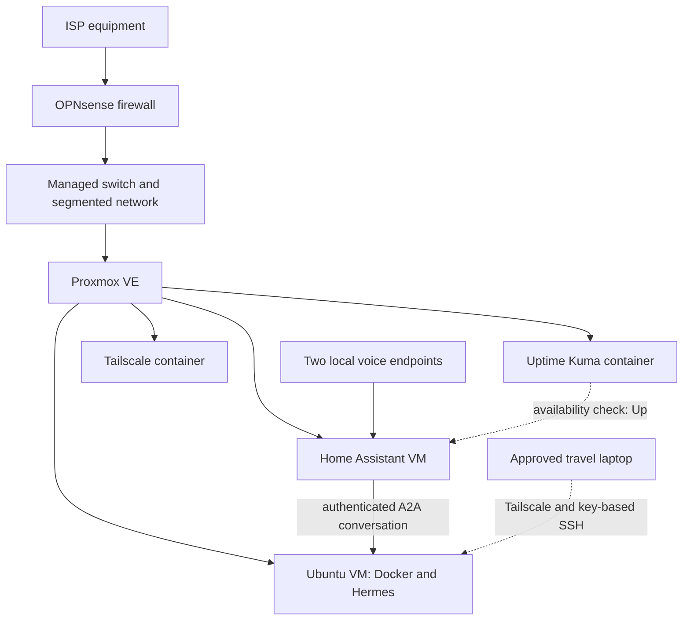
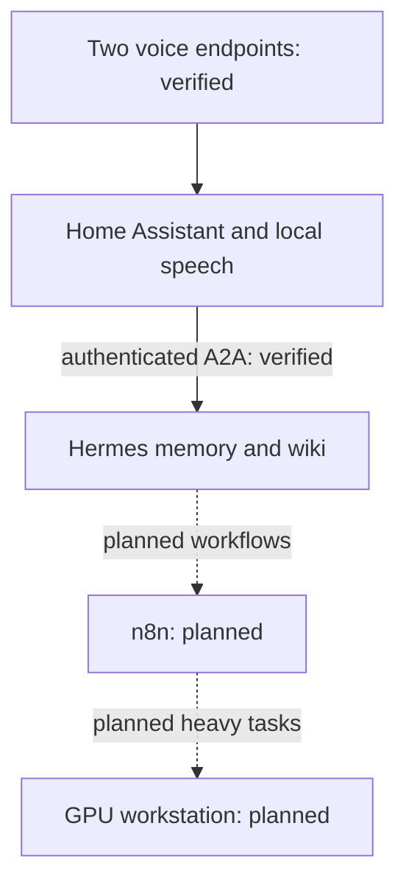

# HomeLab Architecture

> **Last verified:** September 2026  
> **Project status:** Work in progress

This document describes the HomeLab at two different levels:

1. The **current verified state**, which includes only components that are installed or confirmed to be available.
2. The **target architecture**, which represents the intended direction of the project and must not be interpreted as already deployed.

The diagrams intentionally omit real addresses, internal hostnames, wireless network names, remote-access endpoints, firewall rules, credentials, and hardware identifiers.

## Current Verified State

The dedicated OPNsense appliance provides the firewall, routing, and VLAN gateway layer for the HomeLab. Its upstream connection remains behind the existing ISP equipment, while its internal connection feeds the managed PoE switch. OPNsense has been updated to `26.7.2_2`, and internet and DNS connectivity have been verified after the network changes.

The managed switch is running firmware `3.30.6`, its local administration is accessible, and three role-based VLANs are active. The Proxmox host is running Proxmox VE `9.2.11` and remains reachable from an approved client segment. Initial DNS-access and cross-segment isolation policies have been applied and tested.

The Ubuntu service VM uses private name resolution, key-based remote administration, and a validated Docker platform. Hermes Agent `0.20.6` is deployed; persistent memory, approval-gated writes, its authenticated A2A service, and an initial persistent-wiki query have been verified. Home Assistant Core `2026.9.1` runs on Home Assistant OS `18.2` in a separate VM. Both Voice Preview Edition units are onboarded and verified through the Spanish Whisper-to-Hermes-to-Piper conversation path. Approved home-device control and continuous full-path monitoring remain separate milestones.

Uptime Kuma runs as a separate container workload with initial alerting configured. The Home Assistant monitor was saved and reported **Up**. This confirms the configured availability check at that time; it does not establish complete service coverage, successful notification delivery for every monitor, or recovery capability.

Tailscale provides private remote administration of the Hermes host. The selected travel laptop has passed an external-network access test through a mobile hotspot. A dedicated Tailscale container is also present in the workload inventory; that alone does not establish verified subnet routing, Exit Node operation, or network-wide access. Broader remote-access policy and client validation remain in progress.

Final private network-configuration backups have been saved and verified. Earlier encrypted VM and container backups were copied to separate storage and checked with matching SHA-256 checksums. After the assistant integration became stable, protected compressed Proxmox snapshots of both the Hermes and Home Assistant guests completed successfully. An encrypted Home Assistant application backup and private Hermes configuration safety copies also exist. Controlled restoration remains pending.

The following diagram shows workload placement and the tested access and monitoring relationships. It is not a map of firewall permissions.

```mermaid
flowchart TD
    ISP["ISP equipment"] --> FW["OPNsense firewall"]
    FW --> SW["Managed switch and segmented network"]
    SW --> PVE["Proxmox VE"]
    PVE --> HERMES["Ubuntu VM: Docker and Hermes"]
    PVE --> HA["Home Assistant VM"]
    PVE --> KUMA["Uptime Kuma container"]
    PVE --> TS["Tailscale container"]
    VOICE["Two local voice endpoints"] --> HA
    HA -->|"authenticated A2A conversation"| HERMES
    KUMA -. "availability check: Up" .-> HA
    REMOTE["Approved travel laptop"] -. "Tailscale and key-based SSH" .-> HERMES
```

### Verified Components

| Layer | Component | Verified state |
| --- | --- | --- |
| Physical | 12U rack and rack accessories | Completed; equipment placement, physical cabling, private labeling, ventilation checks, and power-distribution review have been verified. |
| Compute | GMKtec virtualization host | Proxmox VE `9.2.11` is installed, updated, accessible through its segmented management path, and protected with a separate administrative account and multi-factor authentication. |
| Storage | Proxmox local storage | An operating system ISO has been uploaded. |
| Virtualization | Virtual machines and containers | The hardened Ubuntu Server `24.04.4 LTS` guest hosts Docker and Hermes. Home Assistant has a separate VM; Uptime Kuma and Tailscale have separate container workloads. |
| Edge security | Dedicated Intel N100 appliance | OPNsense `26.7.2_2` is installed; routing, DHCP, DNS, internet access, local administration, segmented access, and initial cross-segment policy enforcement have been verified. |
| Switching | TP-Link managed PoE switch | Firmware `3.30.6` is installed; private management, traffic forwarding, and three role-based VLANs are operational. |
| Containers | Docker Engine and Docker Compose | Docker Engine `29.7.2` and Docker Compose `5.5.0` are installed and validated on the first Linux guest. |
| Assistant | Hermes Agent | Version `0.20.6` is deployed; persistent memory, approval-gated writes, authenticated A2A messaging, and initial wiki retrieval are verified. |
| Remote access | Tailscale private overlay | Private administration of the Hermes host is externally tested, including access from the selected travel laptop through a mobile hotspot. The dedicated container's presence does not by itself verify routed access. |
| Home automation | Home Assistant | Core `2026.9.1` on OS `18.2`, with connected mobile apps, two onboarded voice endpoints, Whisper `3.5.3`, Piper `2.3.4`, and the Hermes A2A conversation path verified. Device actions remain pending. |
| Availability monitoring | Uptime Kuma | Operational with initial alerting configured; the Home Assistant monitor reported **Up** after saving. |
| Recovery | Stable guest snapshots and application backup | Protected compressed snapshots completed for both principal guests, and an encrypted Home Assistant application backup exists. Controlled restoration has not yet been demonstrated. |
| Future services | n8n, Prometheus, and Grafana | Planned; not documented as deployed. |

## Verified Network Segmentation

OPNsense remains the firewall, routing, DNS, and policy-enforcement layer, while the managed switch transports the segmented network to approved devices. Three VLANs have been deployed and preserved through the final update and validation cycle. Initial rules allow required DNS and approved administrative access while blocking tested cross-segment paths that are not required. Public labels are deliberately generic and do not reveal live VLAN identifiers, addressing, port assignments, or policy details.

VLAN transport, approved Proxmox reachability, internet access, segment-specific DNS access, and selected isolation paths have been verified. The separate Tailscale overlay provides tested remote access to the Hermes host, including the travel-laptop test. These tests establish an initial least-privilege baseline; comprehensive policy review, broader remote administration, and workload-level isolation remain future work. A service being reachable or monitored does not prove that every unwanted cross-segment path is blocked.

## Target Logical Architecture

Proxmox VE remains the virtualization layer for the operational assistant, home-automation, monitoring, and remote-access workloads. Their separate placement allows maintenance to be planned by role. Future integrations must define permissions, secret handling, health checks, and recovery procedures before they are treated as operational.

```mermaid
flowchart TD
    VOICE["Two voice endpoints: verified"] --> HA["Home Assistant and local speech"]
    HA -->|"authenticated A2A: verified"| HERMES["Hermes memory and wiki"]
    HERMES -. "planned workflows" .-> N8N["n8n: planned"]
    N8N -. "planned heavy tasks" .-> GPU["GPU workstation: planned"]
```

The solid path records successful text and voice conversations from both endpoints, including persistent-memory and initial wiki retrieval. It does not establish approved home-device control, broad permissions, or continuous reliability. The dashed relationships remain intended integrations. n8n, Prometheus, Grafana, and GPU integration remain planned. Initial Uptime Kuma availability checks do not replace full conversation-path, metrics, and capacity monitoring.

The GPU-equipped primary workstation is not intended to be permanently dedicated to Hermes or other HomeLab services. The target design treats it as an on-demand compute node for approved heavy local-AI tasks. When the workstation is off, an authorized automation may request Wake-on-LAN; automatic suspension or shutdown after an automated task will be evaluated later. The GPU must remain available for interactive workloads such as streaming and must not be consumed merely because the computer is powered on.

## Functional Layers

| Layer | Planned role | Current status |
| --- | --- | --- |
| Edge and routing | OPNsense routing, firewalling, VLAN gateways, and controlled remote access | Operational segmented foundation with initial DNS and isolation policies verified; comprehensive policy review and network-wide remote administration remain pending. |
| Remote access | Private access to selected services from approved external devices | Tailscale access to the Hermes host is operational; the selected travel laptop passed an external mobile-hotspot test. Broader client validation and policy refinement remain in progress. |
| Network distribution | Managed switching and role-based segmentation | Traffic forwarding, private management, firmware, and three VLANs are operational. |
| Virtualization | Virtual machines and separate service workloads | Proxmox VE `9.2.11` hosts the Ubuntu assistant guest, a separate Home Assistant VM, and container workloads for Uptime Kuma and Tailscale. |
| Containers | Reproducible deployment of selected services | Docker Engine `29.7.2` and Docker Compose `5.5.0` are operational on the first guest. |
| Home automation | Home Assistant and local voice interfaces | Home Assistant, selected mobile apps, both voice endpoints, Whisper speech-to-text, Piper text-to-speech, and the Hermes A2A conversation path are operational. Approved control actions and continuous monitoring remain in progress. |
| Observability | Availability checks, alerts, metrics, and dashboards | Uptime Kuma and initial alerting are configured; Home Assistant reported **Up**. Broader coverage and notification validation remain in progress. Prometheus and Grafana are planned. |
| Assistant platform | Persistent local assistant using Hermes Agent | Operational deployment with cross-session memory, approval-gated writes, authenticated A2A conversation, both voice endpoints, and initial wiki retrieval verified. |
| AI compute | Heavy local inference on the GPU-equipped workstation | Planned as an on-demand node; Wake-on-LAN and workload controls are not yet integrated. |
| Storage and backups | Network configuration, workload and service backups, future NAS, and recovery procedures | Earlier encrypted workload copies passed transfer-integrity validation. Protected compressed snapshots of the stable Hermes and Home Assistant guests and an encrypted Home Assistant application backup now exist. Recurring rotation and controlled restoration remain pending. |

## Architecture Principles

The project will follow these principles as it evolves:

- **Verified documentation:** deployed and planned components are always identified separately.
- **Least privilege:** services should receive only the access needed for their role.
- **Separation of responsibilities:** firewalling, virtualization, automation, monitoring, and experimental workloads should remain logically distinct.
- **Safe changes:** major network changes should be tested before becoming the primary network path.
- **Reproducibility:** relevant deployment steps and sanitized example configurations should be documented.
- **Observability:** important services should eventually expose health and performance information without publishing sensitive operational data.
- **Recoverability:** private network-configuration and encrypted workload backups are retained and integrity-checked, while restoration procedures must still be tested before recovery is treated as dependable.
- **Privacy by design:** public documentation must not reveal details that could identify or weaken the live environment.

## Future Documentation

The existing physical-setup, Proxmox, network-design, roadmap, and changelog documents will be updated as milestones are verified. New implementation records will be added only after the corresponding work is completed. Planned topics include:

- Hermes Agent expansion and integration notes
- Segmentation policy refinement and recovery-validation notes
- Service deployment records
- Backup rotation, controlled restoration, and recovery procedures

## Public Documentation Boundaries

Future diagrams and examples will use descriptive labels and documentation-only values. The public repository will not include:

- Real public or private IP addresses
- Internal DNS names or Wi-Fi identifiers
- MAC addresses, serial numbers, or device labels
- Credentials, tokens, private keys, certificates, or recovery codes
- Complete firewall exports or backup files
- Remote-access endpoints
- Camera streams, access details, or private physical-layout information

These boundaries allow the project to demonstrate architecture and operational knowledge without exposing the live HomeLab.
