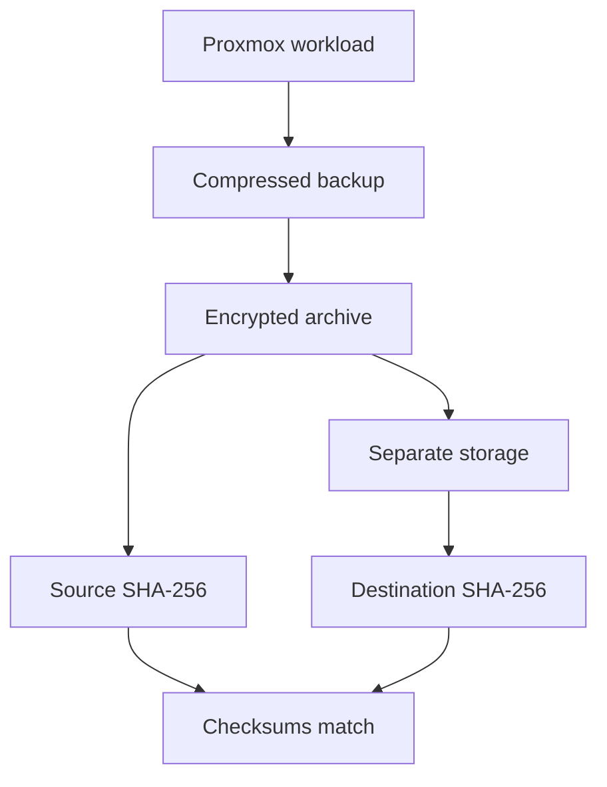

# Backup and Recovery

> **Last verified:** September 2026  
> **Project status:** Initial encrypted workload baseline and follow-up virtual-machine backup verified; controlled restoration pending

This document records the verified backup milestones for the HomeLab virtualization workloads. It describes the initial protected baseline, a later manual virtual-machine backup cycle, encryption, secondary storage, integrity validation, and remaining recovery work without exposing live identifiers, filenames, paths, hashes, credentials, or storage details.

## Verified Backup Scope

Initial backups have been created for the current Proxmox virtual machine and container workloads. Together, these copies establish the first protected workload baseline beyond the existing private network-configuration and pre-update host-configuration backups.

After further configuration changes, the virtual-machine workflow was performed again. A new compressed archive was created, encrypted, transferred to separate storage, and checked against its encrypted source. The matching SHA-256 result confirms that a newer protected copy reached the secondary location without detected transfer corruption.

The public documentation deliberately identifies the workloads only by virtualization type. Their numeric identifiers, names, service roles, storage volumes, resource configuration, and backup filenames remain private.

## Verified Progress

| Stage | Status | Verified result |
| --- | --- | --- |
| Virtual-machine backup | **Completed** | A compressed backup of the current virtual machine was created successfully. |
| Container backup | **Completed** | A compressed backup of the current container was created successfully. |
| Backup encryption | **Completed** | Protected encrypted copies were created before transfer to secondary storage. |
| Secondary copy | **Completed** | The encrypted workload backups were copied away from the primary virtualization host. |
| Source checksum | **Recorded privately** | A SHA-256 checksum was calculated for each encrypted source backup. |
| Destination checksum | **Verified** | Each secondary copy produced the same SHA-256 checksum as its encrypted source. |
| Follow-up virtual-machine cycle | **Completed and integrity-verified** | The manual create, encrypt, transfer, and SHA-256 comparison workflow was repeated successfully after later configuration changes. |
| Local working archives | **Temporarily retained** | Unencrypted working archives remain protected on the virtualization host while cleanup and retention handling are finalized. |
| Controlled restoration | **Pending** | Integrity verification confirms that the copied bytes match; it does not prove that either workload can be restored and started successfully. |
| Automated schedule and retention | **Pending** | Recurring jobs, retention periods, rotation, and capacity alerts have not yet been finalized. |

## Backup Workflow

The following workflow was verified during the initial baseline and later repeated for the virtual-machine backup:

1. Create a compressed Proxmox backup for the selected workload.
2. Produce an encrypted copy using private encryption material.
3. Calculate a SHA-256 checksum for the encrypted source.
4. Copy the encrypted archive to separate storage.
5. Calculate SHA-256 again at the destination.
6. Confirm that the source and destination checksums match exactly.
7. Retain the local working archive temporarily under explicit protection until cleanup is reviewed.

This diagram represents the verification sequence only. It is not a disclosure of the live storage topology or operational commands.

## Follow-up Backup Validation

The later virtual-machine cycle provides evidence that the documented manual procedure can be executed again after the workload changes. It produced a new encrypted recovery source on storage separate from the virtualization host and confirmed byte-for-byte consistency between the encrypted source and its transferred copy.

This repetition does not establish automated scheduling, retention rotation, or recovery readiness. It also does not show that every future execution will succeed without validation. Each protected copy must continue to be checked, and a controlled restoration remains necessary.

## What the Integrity Check Proves

Matching SHA-256 checksums provide evidence that:

- The encrypted file arrived at the secondary location without detected alteration.
- The copied file is byte-for-byte consistent with the encrypted source used for comparison.
- Transfer corruption was not detected during this validation cycle.

The checksum comparison does **not** prove that:

- The encryption passphrase or recovery material is available and correct.
- The encrypted archive can be decrypted successfully in a recovery scenario.
- Proxmox can restore the archive into an isolated target.
- The restored guest boots, obtains the intended network behavior, or starts its services.
- Hermes Agent configuration and persistent memory behave correctly after restoration.

Those outcomes require a controlled restoration test.

## Security and Privacy Controls

The verified baseline follows these controls:

- Only encrypted workload archives are copied to secondary storage.
- Encryption credentials and recovery material remain outside the public repository.
- Checksums are compared privately and are not published.
- Backup filenames, timestamps, sizes, paths, IDs, and storage destinations are excluded.
- The public repository contains documentation only, never live backup archives.
- Unencrypted working archives remain on the primary host only temporarily and require explicit cleanup or retention decisions.

## Recovery Boundary

The current milestone is correctly described as **an initial encrypted workload baseline plus a follow-up manual virtual-machine backup, copied and integrity-verified**. It must not be described as automated backup rotation or complete disaster recovery.

A future controlled restoration test should verify:

1. Access to the required encryption and recovery material.
2. Successful decryption of a selected protected archive.
3. Restoration into an isolated or otherwise safe target.
4. Successful guest or container start-up.
5. Expected storage, network, and service behavior.
6. Hermes Agent availability and persistent-memory behavior where applicable.
7. Cleanup of temporary restored resources and sensitive test material.
8. A sanitized recovery record that does not expose the live environment.

## Remaining Work

- Decide when protected local working archives should be removed.
- Define recurring backup jobs for virtual machines, containers, service configuration, and persistent data.
- Define retention periods, rotation, capacity thresholds, and failure notifications.
- Convert the validated manual procedure into a reviewed schedule without weakening encryption or secondary-copy controls.
- Keep at least one protected copy separate from the primary virtualization host.
- Perform and document controlled restoration tests.
- Review whether an additional offline or off-site copy is appropriate.
- Revalidate recovery procedures after meaningful infrastructure changes.

## Information Intentionally Omitted

This public document does not include:

- VM or container identifiers and names.
- Backup filenames, timestamps, file sizes, storage IDs, paths, drive letters, or destinations.
- Real SHA-256 values or other identifying metadata.
- Encryption commands, passphrases, private keys, recipients, or recovery material.
- Service credentials, internal hostnames, addresses, VLAN identifiers, or DNS records.
- Unredacted terminal output, logs, screenshots, or configuration exports.

These boundaries allow the project to demonstrate practical backup and integrity-validation work without weakening the live recovery process.
