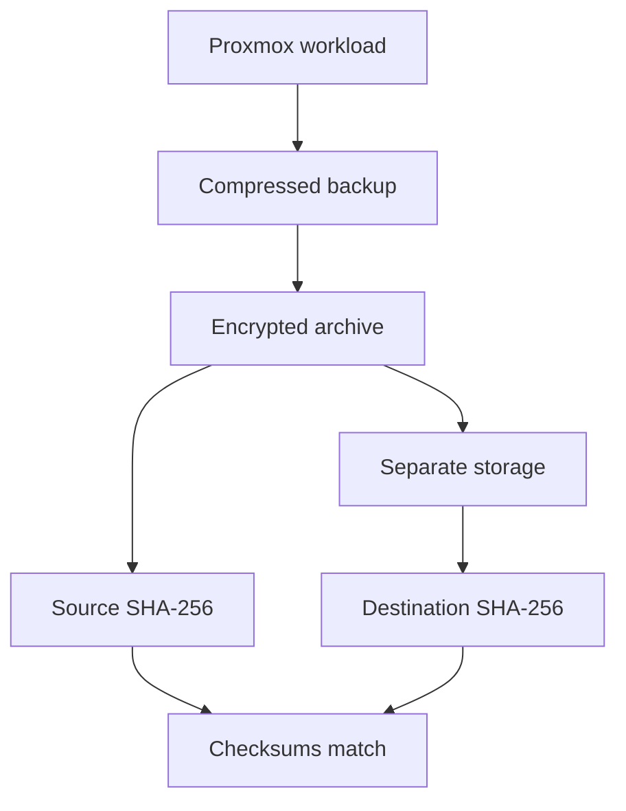

# Backup and Recovery

> **Last verified:** September 2026  
> **Project status:** Earlier encrypted workload copies integrity-verified; protected stable-state snapshots completed for Hermes and Home Assistant; controlled restoration pending

This document records backup milestones for the HomeLab virtualization workloads and service configuration. It distinguishes the earlier encrypted, integrity-checked workload copies from the current protected guest snapshots, the Home Assistant application backup, and private Hermes configuration safety copies. Live identifiers, filenames, paths, hashes, credentials, and storage details are excluded.

## Verified Backup Scope

Initial backups were created for selected Proxmox virtual-machine and container workloads. Together, these copies established the first protected workload baseline beyond the existing private network-configuration and pre-update host-configuration backups. They do not establish backup coverage for every workload added since that baseline.

After further configuration changes, the virtual-machine workflow was performed again. A new compressed archive was created, encrypted, transferred to separate storage, and checked against its encrypted source. The matching SHA-256 result confirms that a newer protected copy reached the secondary location without detected transfer corruption.

After the Home Assistant-to-Hermes voice integration reached a stable tested state, protected compressed Proxmox snapshot jobs completed successfully for both principal guests. Home Assistant also produced an encrypted local application backup containing its configuration and installed voice applications. These are additional recovery sources; they do not prove recoverability until controlled restoration succeeds. Live guest identifiers, hostnames, storage volumes, resource configuration, and backup filenames remain private.

## Verified Progress

| Stage | Status | Verified result |
| --- | --- | --- |
| Initial virtual-machine backup | **Completed** | A compressed backup of the selected virtual machine was created successfully. |
| Initial container backup | **Completed** | A compressed backup of the selected container was created successfully. |
| Backup encryption | **Completed** | Protected encrypted copies were created before transfer to secondary storage. |
| Secondary copy | **Completed** | The encrypted workload backups were copied away from the primary virtualization host. |
| Source checksum | **Recorded privately** | A SHA-256 checksum was calculated for each encrypted source backup. |
| Destination checksum | **Verified** | Each secondary copy produced the same SHA-256 checksum as its encrypted source. |
| Follow-up virtual-machine cycle | **Completed and integrity-verified** | The manual create, encrypt, transfer, and SHA-256 comparison workflow was repeated successfully after later configuration changes. |
| Home Assistant VM recovery copy | **Created, encrypted, and exported** | A VM-level recovery source was created, protected with private encryption material, and exported to secondary storage. |
| Home Assistant source-to-copy integrity | **Not established in this record** | The earlier checksum results cannot be attributed to this recovery copy. A matching source-to-copy result still needs to be documented. |
| Hermes configuration safety copy | **Created privately** | A copy of the active configuration was retained after the initial voice-path validation. It is not presented as a complete assistant backup. |
| Stable Hermes guest snapshot | **Completed and protected** | A compressed snapshot-mode Proxmox backup completed successfully after the A2A voice path was validated. |
| Stable Home Assistant guest snapshot | **Completed and protected** | A compressed snapshot-mode Proxmox backup completed successfully after the same integration milestone. |
| Home Assistant application backup | **Created and encrypted locally** | The application backup includes Home Assistant configuration and installed voice applications; restoration remains untested. |
| Local working archives | **Temporarily retained** | Unencrypted working archives remain protected on the virtualization host while cleanup and retention handling are finalized. |
| Controlled restoration | **Pending** | Earlier checksum matches and inspection of the newer application archive do not prove that a workload or application can be restored successfully. |
| Automated schedule and retention | **Pending** | Recurring jobs, retention periods, rotation, and capacity alerts have not yet been finalized. |

## Earlier Virtualization Backup Workflow

The following workflow was verified during the initial baseline and later repeated for the virtual-machine backup:

1. Create a compressed Proxmox backup for the selected workload.
2. Produce an encrypted copy using private encryption material.
3. Calculate a SHA-256 checksum for the encrypted source.
4. Copy the encrypted archive to separate storage.
5. Calculate SHA-256 again at the destination.
6. Confirm that the source and destination checksums match exactly.
7. Retain the local working archive temporarily under explicit protection until cleanup is reviewed.

```mermaid
flowchart TD
    WORKLOAD["Proxmox workload"] --> ARCHIVE["Compressed backup"]
    ARCHIVE --> ENCRYPTED["Encrypted archive"]
    ENCRYPTED --> SECONDARY["Separate storage"]
    ENCRYPTED --> HASH_A["Source SHA-256"]
    SECONDARY --> HASH_B["Destination SHA-256"]
    HASH_A --> MATCH["Checksums match"]
    HASH_B --> MATCH
```

This diagram represents the verification sequence only. It is not a disclosure of the live storage topology or operational commands.

## Follow-up Backup Validation

The later virtual-machine cycle provides evidence that the documented manual procedure can be executed again after the workload changes. It produced a new encrypted recovery source on storage separate from the virtualization host and confirmed byte-for-byte consistency between the encrypted source and its transferred copy.

This repetition does not establish automated scheduling, retention rotation, or recovery readiness. It also does not show that every future execution will succeed without validation. Each protected copy must continue to be checked, and a controlled restoration remains necessary.

## Home Assistant VM Recovery Copy

The latest Home Assistant recovery milestone consists of:

1. Creating a VM-level backup of the Home Assistant guest.
2. Protecting the recovery copy with private encryption material.
3. Exporting the encrypted copy to secondary storage.

This record establishes the existence and protection state of the exported recovery copy. It does not prove that the archive can be decrypted, restored, or used to recover each Home Assistant component and integration successfully. Filenames and backup contents remain private.

The available record does not establish a matching source-to-copy checksum or a controlled restore for this recovery copy. Those checks must be recorded separately before it is described as integrity-verified or recovery-tested.

| Recovery source | Recorded result | Remaining validation |
| --- | --- | --- |
| Earlier VM and container archives | Encrypted secondary copies with matching SHA-256 checksums; the manual VM cycle was repeated | Decryption, isolated restoration, startup, and service validation |
| Home Assistant VM recovery copy | Encrypted and exported to secondary storage | Source-to-copy integrity comparison, decryption, VM restoration, and functional validation |
| Hermes configuration safety copy | Created privately after the initial voice-path configuration | Protection, integrity comparison, completeness review, and controlled configuration recovery |
| Stable Hermes and Home Assistant guest snapshots | Protected compressed snapshot jobs completed successfully | Isolated restoration, guest startup, and functional validation |
| Home Assistant application backup | Encrypted local backup containing configuration and installed voice applications | Application-level restoration and voice-integration validation |

Uptime Kuma's Home Assistant monitor reported **Up** after saving. That availability result concerns the running service; it provides no validation of the backup copy or its recoverability.

## What the Integrity Check Proves

Matching SHA-256 checksums provide evidence that:

- The encrypted file arrived at the secondary location without detected alteration.
- The copied file is byte-for-byte consistent with the encrypted source used for comparison.
- Transfer corruption was not detected during this validation cycle.

The checksum comparison does **not** prove that:

- The encryption passphrase or recovery material is available and correct.
- The encrypted archive can be decrypted successfully in a recovery scenario.
- Proxmox can restore the archive into an isolated target.
- The restored guest boots, obtains the intended network behavior, or starts its services.
- Hermes Agent configuration and persistent memory behave correctly after restoration.

Those outcomes require a controlled restoration test.

## Security and Privacy Controls

The earlier encrypted virtualization-backup baseline follows these controls:

- Only encrypted workload archives are copied to secondary storage.
- Encryption credentials and recovery material remain outside the public repository.
- Checksums are compared privately and are not published.
- Backup filenames, timestamps, sizes, paths, IDs, and storage destinations are excluded.
- The public repository contains documentation only, never live backup archives.
- Unencrypted working archives remain on the primary host only temporarily and require explicit cleanup or retention decisions.

The Home Assistant VM recovery copy contains potentially sensitive configuration and security material. Its handling must remain private, and neither its contents nor its metadata should be uploaded to the public repository. The Hermes configuration safety copy has a narrower scope and must not be treated as evidence of complete assistant or persistent-memory recovery.

## Recovery Boundary

The current milestone consists of **earlier encrypted workload copies with verified transfer integrity, protected stable-state snapshots for the Hermes and Home Assistant guests, an encrypted Home Assistant application backup, and private Hermes configuration safety copies**. Recurring rotation and tested disaster recovery remain pending.

A future controlled restoration test should verify:

1. Access to the required encryption and recovery material.
2. Successful decryption of a selected protected archive.
3. Restoration into an isolated or otherwise safe target.
4. Successful guest or container start-up.
5. Expected storage, network, and service behavior.
6. Hermes Agent availability and persistent-memory behavior where applicable, or Home Assistant application, speech, and required integration behavior after VM recovery.
7. Cleanup of temporary restored resources and sensitive test material.
8. A sanitized recovery record that does not expose the live environment.

## Remaining Work

- Map the current VM, container, and service inventory to its backup scope and recovery dependencies.
- Document source-to-copy integrity checks for the encrypted Home Assistant VM recovery copy.
- Test restoration of the Home Assistant VM and validate the recovered application, speech components, and required integrations.
- Review protection, completeness, and recovery use of the private Hermes configuration safety copy.
- Perform isolated restoration tests for both protected stable-state guest snapshots.
- Test application-level Home Assistant recovery, including the local speech services and Hermes conversation connector.
- Decide when protected local working archives should be removed.
- Define recurring backup jobs for virtual machines, containers, service configuration, and persistent data.
- Define retention periods, rotation, capacity thresholds, and failure notifications.
- Convert the validated manual procedure into a reviewed schedule without weakening encryption or secondary-copy controls.
- Keep at least one protected copy separate from the primary virtualization host.
- Perform and document controlled restoration tests.
- Review whether an additional offline or off-site copy is appropriate.
- Revalidate recovery procedures after meaningful infrastructure changes.

## Information Intentionally Omitted

This public document does not include:

- VM or container identifiers and names.
- Backup filenames, timestamps, file sizes, storage IDs, paths, drive letters, or destinations.
- Real SHA-256 values or other identifying metadata.
- Encryption commands, passphrases, private keys, recipients, or recovery material.
- Service credentials, internal hostnames, addresses, VLAN identifiers, or DNS records.
- Unredacted terminal output, logs, screenshots, or configuration exports.

These boundaries allow the project to demonstrate practical backup and integrity-validation work without weakening the live recovery process.
