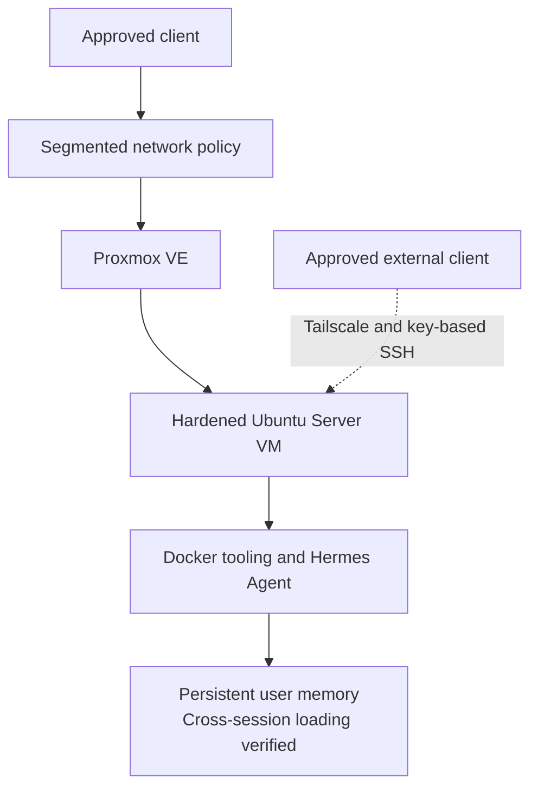

# Hermes Agent Deployment

> **Last verified:** September 2026  
> **Project status:** Initial text-based assistant deployment operational with tested private host access

This document records the first verified Hermes Agent deployment in the HomeLab. It covers the sanitized guest foundation, administration controls, container tooling, assistant validation, and persistent-memory test. Live network values, identities, credentials, configuration files, and private memory content are intentionally excluded.

## Deployment Summary

Hermes Agent is deployed on the first Ubuntu Server virtual machine hosted by Proxmox VE. The guest runs Ubuntu Server `24.04.4 LTS`, is connected through the approved service-network path, and uses private name resolution. System packages were updated before the assistant platform was installed.

Remote administration is restricted to a dedicated non-root account using an encrypted ED25519 key. Password-based SSH authentication and direct root login are disabled. These controls reduce exposure while preserving a maintainable administration path. Tailscale is now operational on the host and one approved client, and the same key-based SSH path has been tested successfully from outside the home network without exposing a public inbound service.

Docker Engine `29.7.2` and Docker Compose `5.5.0` are installed on the guest. The Docker service, container runtime, and a test container were validated. Hermes Agent was then deployed and tested through its initial text interface.

Persistent user memory was also validated: a new Hermes session loaded the stored user profile automatically. This confirms the initial continuity mechanism, but it does not imply that the planned knowledge base, vector retrieval, multi-user profiles, voice interfaces, or external messaging channels are complete.

The assistant workload is covered by the initial encrypted virtual-machine backup, and the protected workflow was later repeated after further configuration changes. The newer archive was encrypted, copied to separate storage, and passed SHA-256 comparison against its encrypted source. This provides a more recent recovery source, but application-level export, decryption, restoration, service start-up, and persistent-memory recovery have not yet been tested.

The sanitized backup workflow and its recovery boundary are documented in [Backup and recovery](backup-and-recovery.md).

The sanitized remote-access path and its current limitations are documented in [Tailscale remote access](tailscale-remote-access.md).

## Verified Components

| Component | Status | Verified result |
| --- | --- | --- |
| Proxmox host | **Operational** | Proxmox VE `9.2.11` provides the segmented virtualization platform. |
| Linux guest | **Operational** | Ubuntu Server `24.04.4 LTS` is installed, updated, and reachable through its approved path. |
| Remote administration | **Hardened and externally tested** | A dedicated non-root account and encrypted key are used; password authentication and direct root login are disabled, and SSH through Tailscale has been verified from one approved external client. |
| Docker Engine | **Operational** | Version `29.7.2` is installed and its service and runtime have been verified. |
| Docker Compose | **Operational** | Version `5.5.0` is installed and available. |
| Container validation | **Completed** | A disposable test container completed successfully. |
| Hermes Agent | **Operational initial deployment** | The assistant is installed and usable through its initial text workflow. |
| Persistent user memory | **Verified** | A fresh session loaded the stored user profile automatically. |
| Workload backup | **Initial baseline and follow-up copy integrity-verified** | The assistant VM is covered by encrypted backups stored separately from the host, including a later manually executed cycle after further changes; controlled restoration remains pending. |

## Current Logical Path

The diagram uses generic public labels. The real client identity, network segment, addressing, DNS record, VM identifier, account name, storage path, and memory contents remain private.

## Security Controls

The verified baseline includes:

- Administration from an approved network path.
- A dedicated non-root operating-system account.
- Key-based SSH authentication with an encrypted private key.
- Password-based SSH authentication disabled.
- Direct SSH login as root disabled.
- Private Tailscale access limited to enrolled devices, with the initial external path verified.
- No direct public inbound service required for the tested remote-administration path.
- Current guest operating-system packages at the time of validation.
- Maintained Docker packages installed from the upstream repository.
- No secrets or live assistant configuration committed to the public repository.

This is an initial baseline, not a complete security review. Service-level permissions, outbound access, update routines, monitoring, backup rotation, and incident recovery must be reviewed as the assistant gains new tools and integrations.

## Persistent Memory Validation

The initial memory test followed a simple evidence-based sequence:

1. Store a sanitized user-profile entry in Hermes persistent memory.
2. End the active assistant session.
3. Start a new session.
4. Confirm that Hermes loads and uses the stored profile automatically.

The test confirms basic continuity across sessions. It does not yet validate:

- A complete personal knowledge base or RAG system.
- Multiple isolated user profiles.
- Application-level memory export and controlled restoration; the initial and follow-up full-VM backups have passed integrity validation only.
- Conflict resolution or deletion workflows.
- Voice, mobile assistant interfaces, or external messaging access; the verified Tailscale path currently provides host administration only.

## Information Intentionally Omitted

The public repository does not include:

- Real IP addresses, VLAN identifiers, internal DNS names, or hostnames.
- VM identifiers, virtual interface names, MAC addresses, or resource allocations that expose the live environment.
- Operating-system usernames, SSH configuration paths, public keys, private keys, or fingerprints.
- Hermes credentials, provider keys, tokens, private configuration, prompts, or complete memory files.
- Backup filenames, storage paths, encryption details, hashes, or recovery material.
- Screenshots containing terminals, browser sessions, account details, or personal memory content.

## Remaining Work

The next assistant-platform milestones are:

- Define recurring backups and retention for the guest, Hermes configuration, and persistent memory.
- Perform a controlled restoration and confirm Hermes and its memory behave as expected.
- Add a reviewed knowledge-base and retrieval layer.
- Define isolated personal and restricted-user profiles.
- Add monitoring and actionable alerts.
- Enroll and externally test the selected travel and backup clients.
- Review Tailscale access policy, device lifecycle, and recovery procedures.
- Provide an approved remote Hermes conversation interface; the current verified route is an administrative SSH path to the host.
- Integrate Home Assistant and the available local voice hardware.
- Evaluate approved on-demand GPU workloads without interfering with interactive workstation use.

Each milestone will be documented only after it has been completed and verified.
