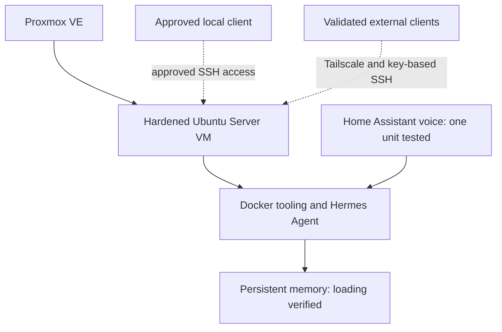

# Hermes Agent Deployment

> **Last verified:** September 2026  
> **Project status:** Text workflow operational; approval-gated memory writes and an initial Home Assistant voice path verified

This document records the first verified Hermes Agent deployment in the HomeLab. It covers the sanitized guest foundation, administration controls, container tooling, assistant validation, and persistent-memory test. Live network values, identities, credentials, configuration files, and private memory content are intentionally excluded.

## Deployment Summary

Hermes Agent is deployed on the first Ubuntu Server virtual machine hosted by Proxmox VE. The guest runs Ubuntu Server `24.04.4 LTS`, is connected through the approved service-network path, and uses private name resolution. System packages were updated before the assistant platform was installed.

Remote administration is restricted to a dedicated non-root account using an encrypted ED25519 key. Password-based SSH authentication and direct root login are disabled. Tailscale provides private host access, and the key-based SSH path has been tested outside the home network without publishing a public inbound service. The selected travel laptop passed a mobile-hotspot test. A tablet also accessed the host through Termius while using a phone hotspot; validation of further selected clients remains in progress.

Docker Engine `29.7.2` and Docker Compose `5.5.0` are installed on the guest. The Docker service, container runtime, and a test container were validated. Hermes Agent was then deployed and tested through its initial text interface.

Persistent user memory was also validated: a new Hermes session loaded the stored user profile automatically. Memory writes now require explicit approval, and a temporary test entry was approved and then removed successfully. These results confirm basic continuity and the write-approval lifecycle, but they do not imply that the planned knowledge base, vector retrieval, multi-user profiles, or external messaging channels are complete.

The HomeLab backup record includes initial encrypted VM and container copies and a later manual VM cycle, all checked against their encrypted sources after transfer. Their exact service scope is not established in that public record, so the follow-up archive is not attributed specifically to Hermes here. Current Hermes backup coverage and its configuration and memory recovery requirements need an explicit mapping. Application-level export, decryption, restoration, service startup, and persistent-memory recovery are not documented as tested.

Home Assistant and Uptime Kuma are operational as separate workloads on Proxmox. One Home Assistant Voice Preview Edition unit completed onboarding, and one request returned the expected user-specific response through the configured Home Assistant-to-Hermes path in approximately ten seconds. Uptime Kuma has initial alerting configured, and its Home Assistant monitor reported **Up**. The single voice result does not establish reliable repeated operation, acceptable latency, validation of the second voice unit, Hermes control of home devices, or direct monitoring of the assistant workflow.

A private Hermes configuration safety copy was created after the initial voice path reached this working state. It is a rollback aid for the current configuration, not a complete, integrity-verified, or restoration-tested assistant backup.

The sanitized backup workflow and its recovery boundary are documented in [Backup and recovery](backup-and-recovery.md).

The sanitized remote-access path and its current limitations are documented in [Tailscale remote access](tailscale-remote-access.md).

## Verified Components

| Component | Status | Verified result |
| --- | --- | --- |
| Proxmox host | **Operational** | Proxmox VE `9.2.11` provides the segmented virtualization platform. |
| Linux guest | **Operational** | Ubuntu Server `24.04.4 LTS` is installed, updated, and reachable through its approved path. |
| Remote administration | **Hardened and externally tested** | A dedicated non-root account and encrypted key are used; password authentication and direct root login are disabled. External host access is confirmed for the travel laptop and a selected tablet through mobile hotspots. |
| Docker Engine | **Operational** | Version `29.7.2` is installed and its service and runtime have been verified. |
| Docker Compose | **Operational** | Version `5.5.0` is installed and available. |
| Container validation | **Completed** | A disposable test container completed successfully. |
| Hermes Agent | **Operational initial deployment** | The assistant is installed and usable through its initial text workflow. |
| Persistent user memory | **Verified with write approval** | A fresh session loaded the stored user profile automatically. A temporary write was held for approval, explicitly approved, and later removed. |
| Workload backup | **Service coverage to be explicitly mapped** | Earlier HomeLab VM and container copies passed integrity checks. This record does not establish that the follow-up VM archive covers Hermes; controlled assistant and memory restoration remain pending. |
| Home Assistant voice path | **Initial validation completed** | One request from an onboarded voice unit returned the expected response through Home Assistant and Hermes. Repeated reliability, latency, the second unit, and device actions remain unverified. |
| Configuration safety copy | **Created privately** | A private copy of the active Hermes configuration was retained after the initial integration test. Integrity comparison and restoration are not documented. |
| Monitoring integration | **Pending validation** | Uptime Kuma is deployed, but monitoring of Hermes availability and its functional text workflow is not established by the Home Assistant check. |

## Current Logical Path

```mermaid
flowchart TD
    PVE["Proxmox VE"] --> VM["Hardened Ubuntu Server VM"]
    CLIENT["Approved local client"] -. "approved SSH access" .-> VM
    REMOTE["Validated external clients"] -. "Tailscale and key-based SSH" .-> VM
    VM --> PLATFORM["Docker tooling and Hermes Agent"]
    PLATFORM --> MEMORY["Persistent memory: loading verified"]
    VOICE["Home Assistant voice: one unit tested"] --> PLATFORM
```

The diagram separates workload placement from client access. Proxmox hosts the VM; the tested SSH session connects to the guest. The real client identity, network segment, addressing, DNS record, VM identifier, account name, storage path, and memory contents remain private.

## Security Controls

The verified baseline includes:

- Administration from an approved network path.
- A dedicated non-root operating-system account.
- Key-based SSH authentication with an encrypted private key.
- Password-based SSH authentication disabled.
- Direct SSH login as root disabled.
- Explicit enrollment of participating Tailscale clients, with external host access verified; the complete authorization policy remains under review.
- No direct public inbound service required for the tested remote-administration path.
- Current guest operating-system packages at the time of validation.
- Maintained Docker packages installed from the upstream repository.
- No secrets or live assistant configuration committed to the public repository.

This is an initial baseline, not a complete security review. Service-level permissions, outbound access, update routines, monitoring, backup rotation, and incident recovery must be reviewed as the assistant gains new tools and integrations.

## Persistent Memory Validation

The initial memory test followed a simple evidence-based sequence:

1. Store a sanitized user-profile entry in Hermes persistent memory.
2. End the active assistant session.
3. Start a new session.
4. Confirm that Hermes loads and uses the stored profile automatically.

The test confirms basic continuity across sessions. It does not yet validate:

- A complete personal knowledge base or RAG system.
- Multiple isolated user profiles.
- Application-level memory export and controlled restoration; earlier HomeLab VM checksum results do not establish Hermes memory recovery.
- General conflict resolution across multiple writers or a complete retention policy.
- A complete mobile assistant interface or external messaging access; the verified Tailscale path currently provides host administration only.

## Approval-Gated Memory Write

The write-control test followed a separate sequence:

1. Submit a temporary, non-sensitive memory entry.
2. Confirm that the entry remains pending instead of being written immediately.
3. Approve the pending write explicitly.
4. Confirm the approved entry and then remove it.

This verifies the basic pending, approval, and deletion lifecycle. It does not establish multi-user authorization, policy enforcement for every tool, or a complete RAG design. The temporary content, operation identifiers, storage locations, and session details remain private.

## Initial Home Assistant Voice Path

One onboarded voice unit sent a request through Home Assistant to Hermes and received the expected user-specific response in approximately ten seconds. This verifies one end-to-end conversational path. It does not yet prove stable repeated operation, acceptable performance, second-unit coverage, or permissioned device control.

## Information Intentionally Omitted

The public repository does not include:

- Real IP addresses, VLAN identifiers, internal DNS names, or hostnames.
- VM identifiers, virtual interface names, MAC addresses, or resource allocations that expose the live environment.
- Operating-system usernames, SSH configuration paths, public keys, private keys, or fingerprints.
- Hermes credentials, provider keys, tokens, private configuration, prompts, or complete memory files.
- Memory approval identifiers, voice transcripts, gateway logs, conversation identifiers, or tool-call payloads.
- Backup filenames, storage paths, encryption details, hashes, or recovery material.
- Screenshots containing terminals, browser sessions, account details, or personal memory content.

## Remaining Work

The next assistant-platform milestones are:

- Define recurring backups and retention for the guest, Hermes configuration, and persistent memory; the private configuration safety copy is not a substitute for this work.
- Map the assistant's current data and configuration to the actual backup scope before claiming coverage.
- Perform a controlled restoration and confirm Hermes and its memory behave as expected.
- Add a reviewed knowledge-base and retrieval layer.
- Define isolated personal and restricted-user profiles.
- Add and validate assistant-specific checks and actionable alerts through the existing monitoring platform.
- Complete external validation for the remaining selected clients; travel-laptop and selected-tablet access is already recorded.
- Review Tailscale access policy, device lifecycle, and recovery procedures.
- Provide an approved remote Hermes conversation interface; the current verified route is an administrative SSH path to the host.
- Define and validate approved Home Assistant device actions separately from the working conversational path.
- Repeat the voice-to-Hermes test, assess latency and reliability, and validate the second voice unit.
- Evaluate approved on-demand GPU workloads without interfering with interactive workstation use.

Each milestone will be documented only after it has been completed and verified.
