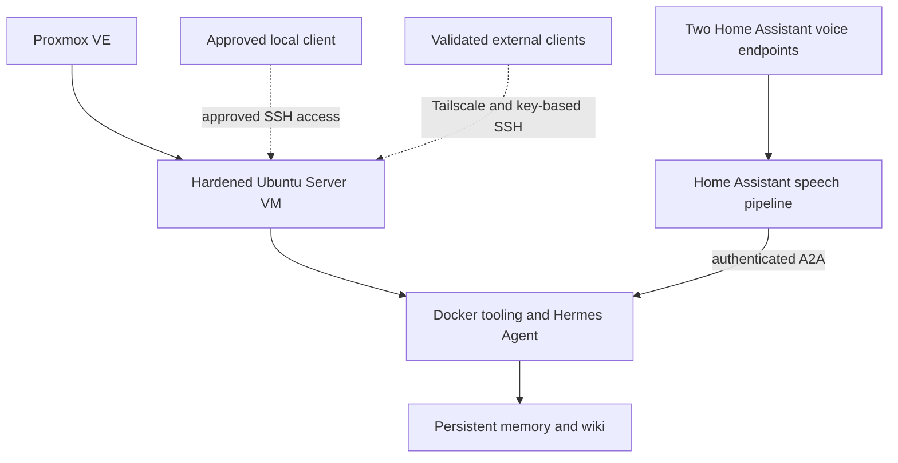

# Hermes Agent Deployment

> **Last verified:** September 2026  
> **Project status:** Hermes `0.20.6` operational; approval-gated memory, authenticated A2A conversation, two voice endpoints, and initial wiki retrieval verified

This document records the verified Hermes Agent deployment in the HomeLab. It covers the sanitized guest foundation, administration controls, container tooling, assistant validation, persistent memory, Home Assistant A2A integration, and initial knowledge retrieval. Live network values, identities, credentials, configuration files, and private memory content are intentionally excluded.

## Deployment Summary

Hermes Agent is deployed on the first Ubuntu Server virtual machine hosted by Proxmox VE. The guest runs Ubuntu Server `24.04.4 LTS`, is connected through the approved service-network path, and uses private name resolution. System packages were updated before the assistant platform was installed.

Remote administration is restricted to a dedicated non-root account using an encrypted ED25519 key. Password-based SSH authentication and direct root login are disabled. Tailscale provides private host access, and the key-based SSH path has been tested outside the home network without publishing a public inbound service. The selected travel laptop passed a mobile-hotspot test. A tablet also accessed the host through Termius while using a phone hotspot; validation of further selected clients remains in progress.

Docker Engine `29.7.2` and Docker Compose `5.5.0` are installed on the guest. The Docker service, container runtime, and a test container were validated. Hermes Agent `0.20.6` was deployed and tested through its text interface and its A2A messaging gateway.

Persistent user memory was also validated: a new Hermes session loaded the stored user profile automatically. Memory writes now require explicit approval, and a temporary test entry was approved and then removed successfully. A persistent LLM Wiki structure is present, and a knowledge query through Home Assistant returned the documented high-level deployment facts. This confirms initial retrieval, not a complete, fully curated RAG corpus or multi-user isolation.

The HomeLab backup record includes earlier encrypted workload copies with verified transfer integrity. After the Home Assistant conversation path became stable, a protected compressed Proxmox snapshot of the Hermes guest completed successfully. Private configuration safety copies also exist. These results establish current backup sources, but decryption where applicable, isolated restoration, service startup, wiki availability, and persistent-memory recovery are not documented as tested.

Home Assistant and Uptime Kuma are operational as separate workloads on Proxmox. A custom Home Assistant conversation connector sends text to Hermes through an authenticated A2A peer and extracts the returned assistant message. Both Home Assistant Voice Preview Edition units completed onboarding and returned the expected persistent-memory response in approximately ten seconds. The active Spanish pipeline uses Whisper `3.5.3` and Piper `2.3.4`. Uptime Kuma has initial alerting configured, and its Home Assistant monitor reported **Up**. Approved device actions and direct functional monitoring of the full assistant workflow remain unverified.

A private Hermes configuration safety copy was created after the initial voice path reached this working state. It is a rollback aid for the current configuration, not a complete, integrity-verified, or restoration-tested assistant backup.

The sanitized backup workflow and its recovery boundary are documented in [Backup and recovery](backup-and-recovery.md).

The sanitized remote-access path and its current limitations are documented in [Tailscale remote access](tailscale-remote-access.md).

## Verified Components

| Component | Status | Verified result |
| --- | --- | --- |
| Proxmox host | **Operational** | Proxmox VE `9.2.11` provides the segmented virtualization platform. |
| Linux guest | **Operational** | Ubuntu Server `24.04.4 LTS` is installed, updated, and reachable through its approved path. |
| Remote administration | **Hardened and externally tested** | A dedicated non-root account and encrypted key are used; password authentication and direct root login are disabled. External host access is confirmed for the travel laptop and a selected tablet through mobile hotspots. |
| Docker Engine | **Operational** | Version `29.7.2` is installed and its service and runtime have been verified. |
| Docker Compose | **Operational** | Version `5.5.0` is installed and available. |
| Container validation | **Completed** | A disposable test container completed successfully. |
| Hermes Agent | **Operational** | Version `0.20.6` is usable through text and the A2A messaging gateway. |
| Persistent user memory | **Verified with write approval** | A fresh session loaded the stored user profile automatically. A temporary write was held for approval, explicitly approved, and later removed. |
| Workload backup | **Protected snapshot completed** | A protected compressed Proxmox snapshot of the stable Hermes guest completed successfully. Controlled assistant, wiki, and memory restoration remain pending. |
| Home Assistant A2A path | **Two-unit conversational validation completed** | The authenticated connector returned Hermes responses through both onboarded voice endpoints. Device actions and full-path monitoring remain unverified. |
| Persistent wiki | **Initial retrieval verified** | The configured wiki returned documented deployment facts through Home Assistant. Corpus curation and bulk ingestion remain in progress. |
| Configuration safety copy | **Created privately** | A private copy of the active Hermes configuration was retained after the initial integration test. Integrity comparison and restoration are not documented. |
| Monitoring integration | **Pending validation** | Uptime Kuma is deployed, but monitoring of Hermes availability and its functional text workflow is not established by the Home Assistant check. |

## Current Logical Path

```mermaid
flowchart TD
    PVE["Proxmox VE"] --> VM["Hardened Ubuntu Server VM"]
    CLIENT["Approved local client"] -. "approved SSH access" .-> VM
    REMOTE["Validated external clients"] -. "Tailscale and key-based SSH" .-> VM
    VM --> PLATFORM["Docker tooling and Hermes Agent"]
    PLATFORM --> MEMORY["Persistent memory and wiki"]
    VOICE["Two Home Assistant voice endpoints"] --> HA["Home Assistant speech pipeline"]
    HA -->|"authenticated A2A"| PLATFORM
```

The diagram separates workload placement from client access. Proxmox hosts the VM; the tested SSH session connects to the guest. The real client identity, network segment, addressing, DNS record, VM identifier, account name, storage path, and memory contents remain private.

## Security Controls

The verified baseline includes:

- Administration from an approved network path.
- A dedicated non-root operating-system account.
- Key-based SSH authentication with an encrypted private key.
- Password-based SSH authentication disabled.
- Direct SSH login as root disabled.
- Explicit enrollment of participating Tailscale clients, with external host access verified; the complete authorization policy remains under review.
- No direct public inbound service required for the tested remote-administration path.
- Current guest operating-system packages at the time of validation.
- Maintained Docker packages installed from the upstream repository.
- No secrets or live assistant configuration committed to the public repository.

This is an initial baseline, not a complete security review. Service-level permissions, outbound access, update routines, monitoring, backup rotation, and incident recovery must be reviewed as the assistant gains new tools and integrations.

## Persistent Memory Validation

The initial memory test followed a simple evidence-based sequence:

1. Store a sanitized user-profile entry in Hermes persistent memory.
2. End the active assistant session.
3. Start a new session.
4. Confirm that Hermes loads and uses the stored profile automatically.

The test confirms basic continuity across sessions. It does not yet validate:

- A complete personal knowledge base or RAG system.
- Multiple isolated user profiles.
- Application-level memory export and controlled restoration; earlier HomeLab VM checksum results do not establish Hermes memory recovery.
- General conflict resolution across multiple writers or a complete retention policy.
- A complete mobile assistant interface or external messaging access; the verified Tailscale path currently provides host administration only.

## Approval-Gated Memory Write

The write-control test followed a separate sequence:

1. Submit a temporary, non-sensitive memory entry.
2. Confirm that the entry remains pending instead of being written immediately.
3. Approve the pending write explicitly.
4. Confirm the approved entry and then remove it.

This verifies the basic pending, approval, and deletion lifecycle. It does not establish multi-user authorization, policy enforcement for every tool, or a complete RAG design. The temporary content, operation identifiers, storage locations, and session details remain private.

## Home Assistant A2A Conversation Path

A custom Home Assistant conversation connector sends recognized text to the Hermes A2A service using per-peer authentication. The response parser accepts the standard A2A task wrapper, returned artifacts, task-status messages, and direct A2A messages. This broader parsing fixed an interoperability issue in which Hermes produced a valid response nested inside a task result that the earlier connector did not extract.

Both onboarded voice endpoints returned the expected user-specific value from Hermes persistent memory in approximately ten seconds. A simple Home Assistant text conversation completed in approximately four to five seconds after the inference-model change. A Home Assistant state lookup required approximately ten seconds of assistant-side processing; the observed natural voice interaction completed within approximately thirty seconds.

One isolated duplicate wake-up was detected and cancelled by Home Assistant. A literal technical entity identifier was also mis-transcribed by the speech recognizer, while a natural-language version of the same request succeeded. These observations are troubleshooting evidence, not persistent-fault or reliability claims.

## Inference Reliability and Latency

The earlier free inference model produced transient upstream gateway and streaming failures, including retries that extended one response to approximately two and a half minutes. The default was changed from `upstage/solar-pro4:free` to `meituan/longcat-2.0:free` through the existing provider. Post-change tests produced a simple text response in approximately four to five seconds and the successful memory and state-query results described above. Free upstream inference remains an external dependency, so continued latency and availability monitoring is required.

## Persistent Wiki Retrieval

Hermes has a persistent LLM Wiki structure for entities, concepts, comparisons, queries, and raw source material. A query through Home Assistant successfully returned the documented high-level deployment facts. A read-only snapshot of the public HomeLab repository was staged as source material, but bulk ingestion was deliberately cancelled after its documentation was found to lag behind the verified environment. The corpus will be ingested only after the public documents are corrected and reviewed.

## Information Intentionally Omitted

The public repository does not include:

- Real IP addresses, VLAN identifiers, internal DNS names, or hostnames.
- VM identifiers, virtual interface names, MAC addresses, or resource allocations that expose the live environment.
- Operating-system usernames, SSH configuration paths, public keys, private keys, or fingerprints.
- Hermes credentials, provider keys, tokens, private configuration, prompts, or complete memory files.
- Memory approval identifiers, voice transcripts, gateway logs, conversation identifiers, or tool-call payloads.
- Backup filenames, storage paths, encryption details, hashes, or recovery material.
- Screenshots containing terminals, browser sessions, account details, or personal memory content.

## Remaining Work

The next assistant-platform milestones are:

- Define recurring backups and retention for the guest, Hermes configuration, and persistent memory; the private configuration safety copy is not a substitute for this work.
- Map the assistant's current data and configuration to the protected snapshot and application-level recovery dependencies.
- Perform a controlled restoration and confirm Hermes, its wiki, and its memory behave as expected.
- Curate and ingest the updated public documentation into the existing knowledge base.
- Define isolated personal and restricted-user profiles.
- Add and validate assistant-specific checks and actionable alerts through the existing monitoring platform.
- Complete external validation for the remaining selected clients; travel-laptop and selected-tablet access is already recorded.
- Review Tailscale access policy, device lifecycle, and recovery procedures.
- Provide an approved remote Hermes conversation interface; the current verified route is an administrative SSH path to the host.
- Define and validate approved Home Assistant device actions separately from the working conversational path.
- Monitor the complete speech, Home Assistant, A2A, inference, and response path and continue latency optimization.
- Evaluate approved on-demand GPU workloads without interfering with interactive workstation use.

Each milestone will be documented only after it has been completed and verified.
