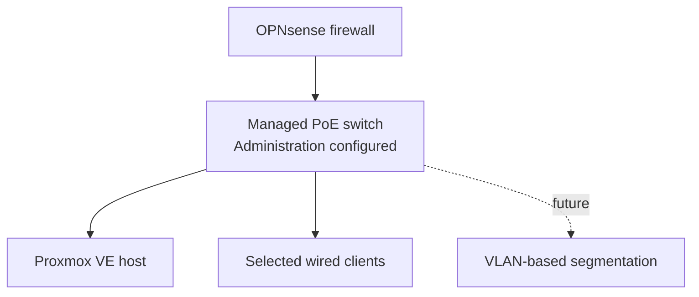

# Managed Switch Deployment

> **Last verified:** August 2026  
> **Project status:** Operational managed-switch foundation; segmentation remains pending

This document records the verified deployment of the TP-Link JetStream managed PoE switch used as the wired distribution point for the HomeLab. It covers its current network role, local management setup, firmware review, validation, and the boundaries that remain before VLAN segmentation is introduced.

The public record intentionally omits the real management address, administrative username, password, MAC address, serial number, exact port assignments, configuration exports, and domestic cable routes.

## Deployment Summary

The managed switch is installed between the OPNsense firewall and selected wired HomeLab devices. It was first used as a basic forwarding point while the firewall and client connectivity were validated. Its local administration interface has since been reached successfully, and a stable private management configuration has been applied.

Firmware information was reviewed against the exact switch family, hardware revision, and regional package requirements before continuing with the management setup. VLANs and advanced Layer 2 features have not yet been introduced.

## Verified Progress

| Stage | Status | Verified result |
| --- | --- | --- |
| Physical connection | **Completed** | The switch is connected between OPNsense and selected wired HomeLab devices. |
| Traffic forwarding | **Verified** | Connected clients can use the base HomeLab network through the switch. |
| Local administration | **Verified** | The switch management interface is reachable from an approved local path. |
| Stable management configuration | **Configured** | A private management address has been assigned and tested without publishing the live value. |
| Administrative access | **Configured privately** | Live credentials are stored outside the public repository. |
| Firmware review | **Completed** | Firmware compatibility was checked against the switch model, hardware revision, and regional requirements. |
| Proxmox connectivity | **Verified** | The virtualization host remains reachable through the managed-switch path. |
| Client connectivity | **Verified** | Selected wired clients retain address assignment, DNS resolution, and internet access. |
| VLAN segmentation | **Not deployed** | VLAN IDs, port profiles, tagging, and inter-network policy remain future work. |
| Configuration backup | **Pending verification** | No public claim is made until a private export and recovery procedure have been confirmed. |

## Current Network Role

The switch currently distributes the unsegmented base HomeLab LAN. The diagram does not disclose physical port numbers, management addressing, cable routes, or device identifiers.

## Management Decisions

The initial switch setup follows these principles:

- Use a stable private management configuration instead of relying on an unpredictable address.
- Keep the administration interface reachable only through an approved local path.
- Match firmware packages to the exact model, hardware revision, and region.
- Validate connectivity after management changes before introducing VLANs.
- Avoid publishing complete port maps or live configuration exports.
- Keep the base network recoverable while advanced features are introduced gradually.

The switch is not described as a fully segmented or hardened production platform. Its current status is an operational managed foundation.

## Validation Performed

The following checks support the current status:

1. Confirm that the local management interface is reachable.
2. Apply and retest the stable private management configuration.
3. Confirm that the OPNsense uplink remains operational.
4. Confirm that the Proxmox host remains accessible.
5. Confirm address assignment, DNS resolution, and internet connectivity from selected wired clients.
6. Review firmware compatibility for the exact switch variant before applying firmware-related changes.
7. Confirm that no VLAN or port-isolation policy has been presented as deployed prematurely.

## Security Considerations

- Administrative credentials must remain outside Git and public screenshots.
- The management interface must not be exposed directly to the internet.
- Firmware must come from the official vendor source and match the exact hardware and region.
- Future remote administration must occur only through an approved secure-access design.
- Configuration backups may contain live management and network details and must remain private.
- SNMP, discovery protocols, logging, and controller integration must be reviewed before being enabled or exposed.
- VLAN changes require a recovery path because an incorrect management VLAN or port profile can remove administrative access.

## Pending Work

The following items remain pending or require separate validation:

- Export and verify a private switch-configuration backup.
- Define a documented local recovery procedure.
- Complete final cable organization and private port labeling.
- Decide whether standalone management or controller-based management best fits the HomeLab.
- Design VLANs around device roles and trust levels.
- Define access, trunk, tagged, and untagged port behavior privately.
- Apply inter-VLAN rules in OPNsense only after the switching design is tested.
- Review loop-prevention, discovery, time, logging, and monitoring settings.
- Validate PoE requirements and budget before powering devices from the switch.
- Add secure monitoring only after its access and credential boundaries are defined.

## Completion Boundary

The switch is correctly described as an **operational managed-switch foundation**. The full network-foundation phase remains **in progress** until backup and recovery procedures, remaining client requirements, final cabling, and the selected segmentation controls have been completed and documented.

## Information Intentionally Omitted

This public document does not include:

- The real management address, subnet, gateway, or management URL
- Administrative usernames, passwords, recovery information, or session data
- MAC addresses, serial numbers, device labels, or account identifiers
- Exact physical port assignments, cable routes, or domestic locations
- Complete configuration exports, logs, packet captures, or screenshots
- VLAN identifiers, live subnets, controller endpoints, or remote-access details
- ISP information, Wi-Fi credentials, or unrelated client information

Any future screenshots or configuration examples must be sanitized at full resolution before publication.
