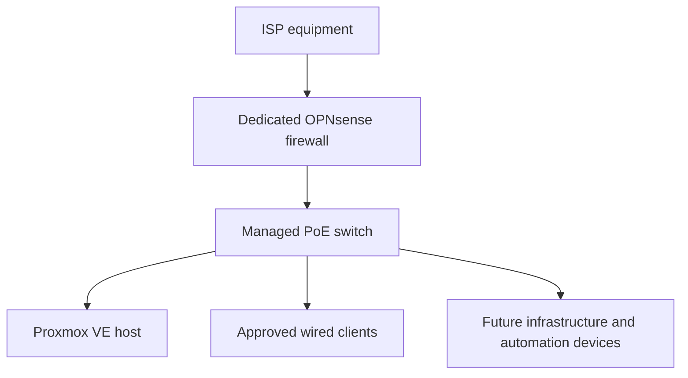

# HomeLab Network Design

> **Last verified:** August 2026  
> **Implementation status:** Planned — the dedicated firewall and managed switch are not yet in the active network path

This document records the intended network foundation for the HomeLab. It describes design goals, deployment order, validation criteria, and public-documentation boundaries without exposing the live home network.

The design below is **not an implementation record**. OPNsense has not yet been installed on the dedicated firewall appliance, the managed switch has not yet been configured, and no VLAN or VPN design has been deployed.

## Current Verified State

The existing home network continues to provide normal connectivity. The Proxmox VE host is installed and has been accessed through that existing network.

| Component | Verified state |
| --- | --- |
| Existing home network | Provides current connectivity. |
| Proxmox VE host | Installed and accessible through the existing network. |
| Dedicated firewall appliance | Available with pfSense preinstalled; migration to OPNsense is pending. |
| Managed PoE switch | Available; not yet connected or configured. |
| Dedicated firewall-to-switch path | Not deployed. |
| VLANs and network segmentation | Not deployed. |
| Remote-access VPN | Not deployed. |

## Target Network Path

This diagram uses generic labels deliberately. The final operating mode of the ISP equipment, physical port assignments, addressing plan, and management details will be documented privately during deployment and represented publicly only in sanitized form.

## Component Responsibilities

| Component | Intended responsibility | Current status |
| --- | --- | --- |
| ISP equipment | Maintain the external service handoff required by the connection | Existing; final integration mode not yet documented. |
| OPNsense appliance | Routing, firewall policy, DHCP/DNS decisions, and later controlled remote access | Planned; not installed or configured. |
| Managed switch | Wired distribution, PoE delivery where required, and later VLAN transport | Pending initial setup. |
| Proxmox VE host | Run isolated guest workloads for future HomeLab services | Hypervisor installed; no complete VM deployed. |
| Client and infrastructure devices | Consume only the connectivity required for their approved roles | Connection plan pending. |

## Design Principles

- **Safe migration:** the new network path must be tested before it replaces normal household connectivity.
- **Rollback first:** the existing working path must remain recoverable during initial deployment.
- **Least privilege:** future rules should allow only the traffic required by each role.
- **Stable foundation before segmentation:** basic routing, DNS, administration, and client access must work reliably before VLANs are introduced.
- **Management protection:** administrative interfaces should not be exposed directly to the internet.
- **Documented changes:** every implementation step should record its objective, result, validation, and recovery method.
- **Privacy by design:** public examples must use placeholders or documentation-only values.

## Initial Deployment Sequence

The intended order is:

1. Record the services and devices that must continue working during the migration.
2. Prepare installation media and a recovery path for the firewall appliance.
3. Install OPNsense and identify WAN and LAN roles locally.
4. Configure the minimum required LAN services without publishing live values.
5. Test the firewall with a limited client before changing the normal network path.
6. Connect the managed switch and secure its management access.
7. Test a wired client and the Proxmox host through the firewall-to-switch path.
8. Validate essential connectivity and retain a tested rollback option.
9. Update this document with the verified implementation result.

This sequence may change if the ISP equipment or required household services introduce dependencies that have not yet been verified.

## Initial Validation Checklist

The network foundation will not be marked as completed until the relevant checks have been performed:

- [ ] OPNsense boots reliably after installation and restart.
- [ ] WAN and LAN roles are confirmed locally.
- [ ] An approved test client receives the intended network configuration.
- [ ] Internet connectivity works through the new path.
- [ ] DNS resolution works as intended.
- [ ] The OPNsense management interface is reachable only from an approved local path.
- [ ] The managed switch is reachable through its approved management path.
- [ ] The Proxmox host remains accessible through the intended administration path.
- [ ] Essential household connectivity has been checked.
- [ ] Disconnecting or reverting the new path has been reviewed or tested.
- [ ] Public evidence has been sanitized before publication.

Passing these checks will verify the base network only. It will not mean that VLANs, VPN access, advanced firewall policy, monitoring, or high availability have been completed.

## Future Segmentation Concept

Network segmentation is planned only after the base path is stable. Possible trust groups include:

- Infrastructure management
- Trusted personal clients
- Home automation and IoT devices
- Cameras and other restricted devices
- Laboratory and experimental workloads
- Guest access

These are conceptual security zones, not deployed VLANs. VLAN identifiers, subnets, switch-port assignments, firewall rules, and inter-zone access policies have not yet been selected or implemented.

Any future segmentation design should define:

- Which devices belong to each trust group
- Which group may initiate connections to another
- Which administrative systems may reach management interfaces
- Which services require internet access
- How DNS, time synchronization, updates, and monitoring will operate
- How local access can be restored after a configuration error

## Public Documentation Boundaries

The public repository may show high-level roles, sanitized diagrams, decision reasoning, and reproducible examples. It must not contain:

- Real public or private IP addresses and subnets
- ISP account or circuit information
- Wi-Fi names or passwords
- Live DNS names, internal hostnames, or remote-access endpoints
- Physical interface mappings that unnecessarily expose the live environment
- MAC addresses, serial numbers, or device labels
- Credentials, tokens, certificates, private keys, or recovery codes
- Complete firewall or switch configuration exports
- Unredacted logs, packet captures, or screenshots
- Camera addresses, streams, credentials, or placement details

Example configurations added later should use explicit placeholders or documentation-only address ranges and must be reviewed before every commit.

## Planned Follow-up Documentation

After the relevant work has been completed and verified, this design will be complemented by:

- OPNsense installation and initial configuration notes
- Managed-switch setup and validation notes
- A sanitized as-built network diagram
- Segmentation and firewall-policy documentation
- VPN design and remote-access validation
- Backup and recovery procedures for network configurations
- Troubleshooting records and lessons learned

Until then, all of these items remain planned work.
