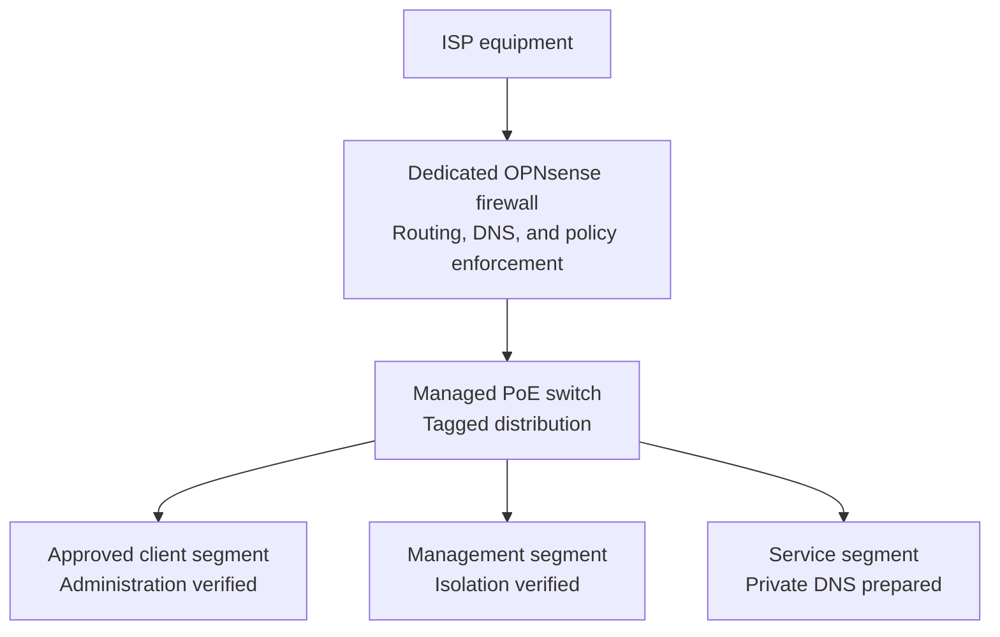

# HomeLab Network Design

> **Last verified:** August 2026  
> **Implementation status:** Operational segmented-network foundation with initial policy enforcement — further hardening and remote access remain in progress

This document records both the verified segmented network foundation and the next planned stages for the HomeLab. It describes the operational path, completed validation work, remaining policy and recovery tasks, and public-documentation boundaries without exposing the live home network.

OPNsense `26.7.2_2` is installed and selected wired devices use the firewall-to-switch path successfully. The managed switch is running firmware `3.30.6`, its private management path is operational, and three role-based VLANs have been deployed and verified. Initial DNS-access, approved-administration, and cross-segment isolation policies have also been tested. VPN access has not been deployed.

## Current Verified State

The existing ISP equipment provides the upstream connection to the dedicated OPNsense appliance. OPNsense provides routing, firewalling, DHCP, DNS, and the VLAN gateways. The managed PoE switch transports the segmented network to the Proxmox host and selected wired clients.

| Component | Verified state |
| --- | --- |
| ISP equipment | Provides the upstream network connection. |
| Dedicated firewall appliance | OPNsense `26.7.2_2` is installed; routing, DHCP, DNS, internet connectivity, local administration, VLAN gateway operation, and initial policy enforcement have been verified. |
| DHCP service | Kea DHCPv4 is active for the HomeLab LAN; final verification and documentation of individual reservations remain pending. |
| Managed PoE switch | Firmware `3.30.6` is installed; private management, traffic forwarding, and three role-based VLANs have been verified. |
| Proxmox VE host | Installed, updated, migrated to its segmented management path, and reachable from an approved client segment after validation. |
| Selected wired clients | Address assignment, segment-specific DNS access, internet connectivity, approved administration, and selected isolation paths have been verified through OPNsense and the switch. |
| Dedicated firewall-to-switch path | Operational and carrying the segmented HomeLab network. |
| VLANs and network segmentation | Three role-based VLANs are deployed. Required DNS access and selected allow-and-block paths between network roles have been verified; live identifiers, mappings, and rules remain private. |
| Remote-access VPN | Not deployed. |

## Operational Segmented Network Path

This diagram uses generic labels deliberately. The operating mode of the ISP equipment, physical port assignments, addressing plan, and management details are documented privately and represented publicly only in sanitized form.

## Component Responsibilities

| Component | Intended responsibility | Current status |
| --- | --- | --- |
| ISP equipment | Maintain the external service handoff required by the connection | In use as the upstream connection. |
| OPNsense appliance | Routing, firewall policy, VLAN gateways, DHCP/DNS services, and later controlled remote access | Operational segmented foundation with initial DNS and isolation policies verified; comprehensive policy review and remote access remain pending. |
| Managed switch | Wired distribution, VLAN transport, and PoE delivery where required | Firmware, private management, traffic forwarding, and three VLANs are operational. |
| Proxmox VE host | Run isolated guest workloads for future HomeLab services | Hypervisor installed and approved administration verified; network and private name resolution are prepared for the first service workload. |
| Client and infrastructure devices | Consume only the connectivity required for their approved roles | Selected allow, DNS, and isolation paths have been verified; comprehensive policy review remains in progress. |

## Design Principles

- **Safe migration:** changes are introduced with selected clients before wider household dependencies are moved.
- **Rollback first:** the upstream network and private configuration backups must remain available during further changes.
- **Least privilege:** current and future rules should allow only the traffic required by each role.
- **Incremental segmentation:** VLAN, gateway, and client changes must be introduced and validated in recoverable stages.
- **Management protection:** administrative interfaces should not be exposed directly to the internet.
- **Documented changes:** every implementation step should record its objective, result, validation, and recovery method.
- **Privacy by design:** public examples must use placeholders or documentation-only values.

## Completed Base Deployment Sequence

The base path was introduced in the following order:

1. Prepare installation media and install OPNsense on the dedicated appliance.
2. Confirm independent boot from internal storage.
3. Assign and test the upstream and internal network roles locally.
4. Enable the minimum required LAN and DHCP services.
5. Test local administration, client addressing, and DNS resolution.
6. Connect the managed switch as the wired distribution point.
7. Test a wired client and the Proxmox host through the firewall-to-switch path.
8. Confirm internet access and save an initial private configuration backup.
9. Reach the switch administration interface and apply stable private management settings.
10. Review firmware compatibility against the exact switch variant.
11. Retest Proxmox and wired-client connectivity after the management changes.
12. Update OPNsense and the switch to the verified software and firmware versions.
13. Deploy three role-based VLANs using private identifiers and port mappings.
14. Migrate the Proxmox management path and verify continued reachability.
15. Confirm that all VLANs, internet access, and DNS resolution remain operational.
16. Save and verify final private network-configuration backups.
17. Apply and verify required DNS access for selected network roles.
18. Confirm approved access to the Proxmox administration path.
19. Apply and verify isolation between selected management and service-oriented roles.
20. Prepare private name resolution for the first planned service workload.
21. Record the verified result using only sanitized public information.

Restoration testing, comprehensive policy review, remote access, and wider household dependencies remain separate follow-up work.

## Initial Validation Checklist

The checklist distinguishes passed base-network tests from the work still required before the complete network-foundation phase can be closed:

- [x] OPNsense boots reliably after installation and restart.
- [x] WAN and LAN roles are confirmed locally.
- [x] An approved test client receives the intended network configuration.
- [x] Internet connectivity works through the new path.
- [x] DNS resolution works as intended.
- [x] The OPNsense management interface is reachable from an approved local path.
- [x] The managed switch is reachable through its approved management path.
- [x] Stable private switch-management settings have been applied and retested.
- [x] Firmware `3.30.6` has been installed after compatibility review.
- [x] Three role-based VLANs have been deployed and verified.
- [x] The Proxmox host remains accessible through its migrated administration path.
- [x] Internet and DNS operation have been retested after segmentation.
- [x] Required DNS access has been verified for selected network roles.
- [x] Proxmox administration has been verified from an approved client segment.
- [x] A selected management-to-service path has been blocked and tested.
- [x] Private name resolution has been prepared and verified for the first planned service workload.
- [ ] Essential household connectivity has been checked.
- [ ] Disconnecting or reverting the new path has been reviewed or tested.
- [x] An initial private OPNsense configuration backup has been exported.
- [x] Final private network-configuration backups have been saved and checked.
- [ ] A controlled restoration procedure has been tested.
- [x] Public documentation has been sanitized before publication.

These checks verify the segmented network foundation and its initial policy baseline. They do not mean that VPN access, comprehensive least-privilege review, monitoring, restoration testing, or high availability have been completed.

## Initial Policy Baseline and Future Refinement

The current deployment uses three role-based VLANs. The verified baseline permits required DNS access, allows approved administration of the virtualization host, and blocks a tested path from a management-oriented role toward a service-oriented role. Private name resolution is prepared for the first planned service workload. Live identifiers, addressing, device membership, port mappings, aliases, and policy values are intentionally documented only in private operational records.

Future policy refinement may consider trust groups such as:

- Infrastructure management
- Trusted personal clients
- Home automation and IoT devices
- Cameras and other restricted devices
- Laboratory and experimental workloads
- Guest access

These are conceptual policy categories and are not a public mapping of the three deployed VLANs. The exact VLAN identifiers, subnets, switch-port assignments, firewall rules, and inter-zone access policies are not disclosed.

Current and future segmentation reviews should define or revalidate:

- Which devices belong to each trust group
- Which group may initiate connections to another
- Which administrative systems may reach management interfaces
- Which services require internet access
- How DNS, time synchronization, updates, and monitoring will operate
- How local access can be restored after a configuration error

## Public Documentation Boundaries

The public repository may show high-level roles, sanitized diagrams, decision reasoning, and reproducible examples. It must not contain:

- Real public or private IP addresses and subnets
- ISP account or circuit information
- Wi-Fi names or passwords
- Live DNS names, internal hostnames, or remote-access endpoints
- Physical interface mappings that unnecessarily expose the live environment
- MAC addresses, serial numbers, or device labels
- Credentials, tokens, certificates, private keys, or recovery codes
- Complete firewall or switch configuration exports
- Unredacted logs, packet captures, or screenshots
- Camera addresses, streams, credentials, or placement details

Example configurations added later should use explicit placeholders or documentation-only address ranges and must be reviewed before every commit.

## Planned Follow-up Documentation

Available implementation records:

- [OPNsense deployment](opnsense-deployment.md)
- [Managed-switch deployment](managed-switch-deployment.md)

Future documentation will cover:

- A sanitized as-built network diagram
- Further segmentation-policy review and restoration-test documentation
- VPN design and remote-access validation
- Backup and recovery procedures for network configurations
- Troubleshooting records and lessons learned

The OPNsense and managed-switch deployment records document the completed segmented foundation. Initial policy enforcement is also verified, while the remaining items in this list are planned work.
