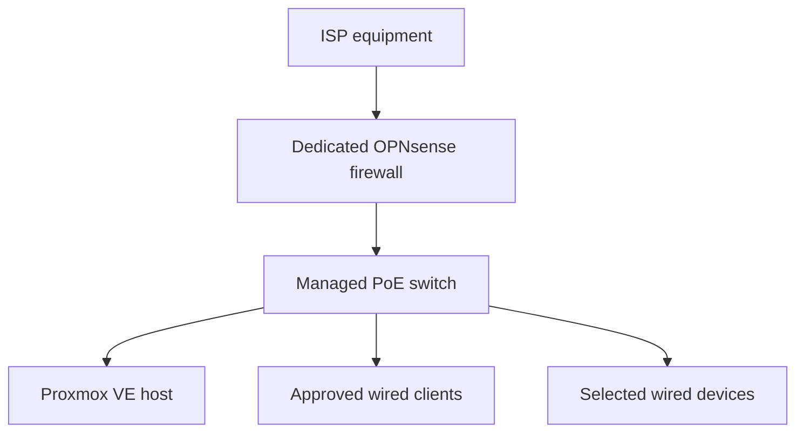

# HomeLab Network Design

> **Last verified:** August 2026  
> **Implementation status:** Operational managed-network foundation — segmentation and remote access remain in progress

This document records both the verified network foundation and the next planned stages for the HomeLab. It describes the operational base path, remaining validation work, segmentation principles, and public-documentation boundaries without exposing the live home network.

OPNsense is installed and selected wired devices use the firewall-to-switch path successfully. The managed switch is forwarding traffic, its local administration is accessible, stable private management settings are configured, and firmware compatibility has been reviewed. No VLAN or VPN design has been deployed.

## Current Verified State

The existing ISP equipment provides the upstream connection to the dedicated OPNsense appliance. OPNsense provides the HomeLab LAN, and the managed PoE switch distributes connectivity to the Proxmox host and selected wired clients.

| Component | Verified state |
| --- | --- |
| ISP equipment | Provides the upstream network connection. |
| Dedicated firewall appliance | OPNsense is installed and the initial WAN, LAN, DHCP, DNS, internet-connectivity, and local-administration checks have passed. |
| DHCP service | Kea DHCPv4 is active for the HomeLab LAN; final verification and documentation of individual reservations remain pending. |
| Managed PoE switch | Connected and forwarding wired traffic; local administration and stable private management are configured, and firmware compatibility has been reviewed. Segmentation remains pending. |
| Proxmox VE host | Installed, updated, and accessible through the HomeLab network path. |
| Selected wired clients | Address assignment, DNS resolution, and internet connectivity have been verified through OPNsense and the switch. |
| Dedicated firewall-to-switch path | Operational for selected HomeLab devices. |
| VLANs and network segmentation | Not deployed. |
| Remote-access VPN | Not deployed. |

## Operational Base Network Path

This diagram uses generic labels deliberately. The operating mode of the ISP equipment, physical port assignments, addressing plan, and management details are documented privately and represented publicly only in sanitized form.

## Component Responsibilities

| Component | Intended responsibility | Current status |
| --- | --- | --- |
| ISP equipment | Maintain the external service handoff required by the connection | In use as the upstream connection. |
| OPNsense appliance | Routing, base firewall policy, LAN addressing, DHCP/DNS services, and later controlled remote access | Operational base; advanced policy and remote access remain pending. |
| Managed switch | Wired distribution, PoE delivery where required, and later VLAN transport | Forwarding traffic with local administration and stable private management configured; VLAN transport remains pending. |
| Proxmox VE host | Run isolated guest workloads for future HomeLab services | Hypervisor installed; no complete VM deployed. |
| Client and infrastructure devices | Consume only the connectivity required for their approved roles | Selected wired devices are connected; final role-based segmentation remains pending. |

## Design Principles

- **Safe migration:** changes are introduced with selected clients before wider household dependencies are moved.
- **Rollback first:** the upstream network and private configuration backups must remain available during further changes.
- **Least privilege:** future rules should allow only the traffic required by each role.
- **Stable foundation before segmentation:** basic routing, DNS, administration, and client access must work reliably before VLANs are introduced.
- **Management protection:** administrative interfaces should not be exposed directly to the internet.
- **Documented changes:** every implementation step should record its objective, result, validation, and recovery method.
- **Privacy by design:** public examples must use placeholders or documentation-only values.

## Completed Base Deployment Sequence

The base path was introduced in the following order:

1. Prepare installation media and install OPNsense on the dedicated appliance.
2. Confirm independent boot from internal storage.
3. Assign and test the upstream and internal network roles locally.
4. Enable the minimum required LAN and DHCP services.
5. Test local administration, client addressing, and DNS resolution.
6. Connect the managed switch as the wired distribution point.
7. Test a wired client and the Proxmox host through the firewall-to-switch path.
8. Confirm internet access and save an initial private configuration backup.
9. Reach the switch administration interface and apply stable private management settings.
10. Review firmware compatibility against the exact switch variant.
11. Retest Proxmox and wired-client connectivity after the management changes.
12. Record the verified result using only sanitized public information.

Switch backup and recovery, segmentation, and wider household dependencies remain separate follow-up work.

## Initial Validation Checklist

The checklist distinguishes passed base-network tests from the work still required before the complete network-foundation phase can be closed:

- [x] OPNsense boots reliably after installation and restart.
- [x] WAN and LAN roles are confirmed locally.
- [x] An approved test client receives the intended network configuration.
- [x] Internet connectivity works through the new path.
- [x] DNS resolution works as intended.
- [x] The OPNsense management interface is reachable from an approved local path.
- [x] The managed switch is reachable through its approved management path.
- [x] Stable private switch-management settings have been applied and retested.
- [x] Firmware compatibility has been reviewed for the exact switch variant.
- [x] The Proxmox host remains accessible through the intended administration path.
- [ ] Essential household connectivity has been checked.
- [ ] Disconnecting or reverting the new path has been reviewed or tested.
- [x] An initial private OPNsense configuration backup has been exported.
- [ ] A private switch-configuration backup and recovery procedure have been verified.
- [x] Public documentation has been sanitized before publication.

Passing these checks will verify the base network only. It will not mean that VLANs, VPN access, advanced firewall policy, monitoring, or high availability have been completed.

## Future Segmentation Concept

Network segmentation is planned only after the base path is stable. Possible trust groups include:

- Infrastructure management
- Trusted personal clients
- Home automation and IoT devices
- Cameras and other restricted devices
- Laboratory and experimental workloads
- Guest access

These are conceptual security zones, not deployed VLANs. VLAN identifiers, subnets, switch-port assignments, firewall rules, and inter-zone access policies have not yet been selected or implemented.

Any future segmentation design should define:

- Which devices belong to each trust group
- Which group may initiate connections to another
- Which administrative systems may reach management interfaces
- Which services require internet access
- How DNS, time synchronization, updates, and monitoring will operate
- How local access can be restored after a configuration error

## Public Documentation Boundaries

The public repository may show high-level roles, sanitized diagrams, decision reasoning, and reproducible examples. It must not contain:

- Real public or private IP addresses and subnets
- ISP account or circuit information
- Wi-Fi names or passwords
- Live DNS names, internal hostnames, or remote-access endpoints
- Physical interface mappings that unnecessarily expose the live environment
- MAC addresses, serial numbers, or device labels
- Credentials, tokens, certificates, private keys, or recovery codes
- Complete firewall or switch configuration exports
- Unredacted logs, packet captures, or screenshots
- Camera addresses, streams, credentials, or placement details

Example configurations added later should use explicit placeholders or documentation-only address ranges and must be reviewed before every commit.

## Planned Follow-up Documentation

Available implementation records:

- [OPNsense deployment](opnsense-deployment.md)
- [Managed-switch deployment](managed-switch-deployment.md)

Future documentation will cover:

- A sanitized as-built network diagram
- Segmentation and firewall-policy documentation
- VPN design and remote-access validation
- Backup and recovery procedures for network configurations
- Troubleshooting records and lessons learned

The OPNsense and managed-switch deployment records document the completed foundation stages. The remaining items in this list are planned work.
