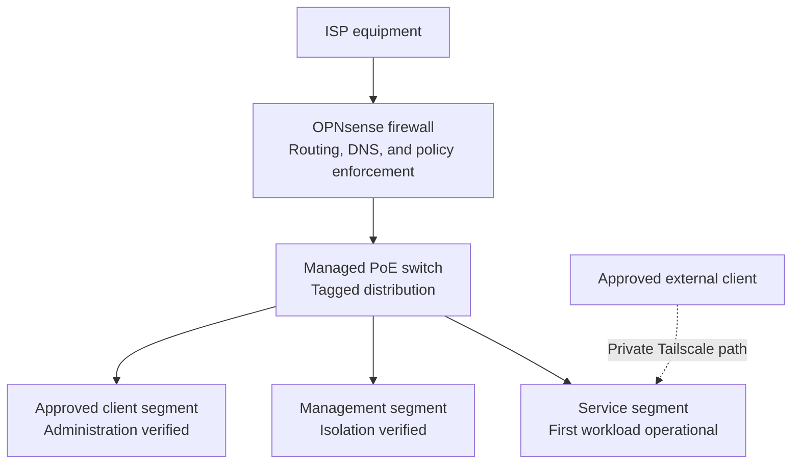

# OPNsense Deployment

> **Last verified:** September 2026  
> **Project status:** Operational segmented firewall foundation with initial policy enforcement and a tested private host-access path; advanced network controls remain in progress

This document records the verified deployment of OPNsense on the dedicated HomeLab firewall appliance. It covers the initial installation, software update, segmented network path, essential connectivity tests, private backup handling, and the security controls that have already been applied.

The document intentionally omits real addresses, interface identifiers, internal names, credentials, recovery data, firewall exports, and other details that could expose the live environment.

## Deployment Summary

The dedicated Intel N100 appliance originally arrived with another firewall platform preinstalled. It was replaced with OPNsense using removable installation media, and the final system was installed on the appliance's internal storage.

After installation, the removable media was disconnected and the appliance was confirmed to boot independently from its internal drive. The initial WAN and LAN roles were assigned and validated before selected devices were moved behind the new firewall path. OPNsense was later updated to `26.7.2_2`, three role-based VLANs were introduced, and connectivity was retested before final private configuration copies were saved and checked. Initial DNS-access, approved-administration, and cross-segment isolation policies were then applied and tested in controlled stages. A Tailscale overlay was subsequently validated between one approved external client and the Hermes host without adding a direct public inbound service to OPNsense.

## Verified Progress

| Stage | Status | Verified result |
| --- | --- | --- |
| Installation media | **Completed** | OPNsense installation media was prepared and used successfully. |
| Internal installation | **Completed** | OPNsense was installed on the firewall appliance's internal storage. |
| Independent boot | **Verified** | The appliance boots without the removable installation media. |
| Software version | **Updated and verified** | OPNsense `26.7.2_2` is installed and operational. |
| WAN role | **Operational** | The upstream interface obtains connectivity from the existing ISP equipment. |
| Internal network role | **Operational and segmented** | OPNsense provides the internal routing and gateway layer for three role-based VLANs. |
| DHCP service | **Operational base** | Kea DHCPv4 is enabled for the LAN and provides addresses to connected clients. Final documentation of individual reservations remains pending. |
| DNS resolution | **Verified by role and workload** | Required DNS access was retested successfully from selected segments, and private name resolution is operational for the first service workload. |
| Internet connectivity | **Verified** | Internet access was retested through OPNsense and the managed switch after segmentation. |
| Proxmox reachability | **Verified from an approved segment** | The virtualization host remains accessible through its migrated administration path from an authorized client role. |
| First service workload | **Operational through approved path** | The Linux guest and Hermes Agent use the intended service path and private name resolution. |
| Private host access | **Externally tested** | One approved client can reach the Hermes host through Tailscale using key-based SSH without direct public port forwarding. |
| Cross-segment isolation | **Initially enforced and tested** | A selected management-to-service path was blocked and its isolation result was verified. |
| Local administration | **Verified** | The web administration interface is reachable from the approved local network. |
| Multi-factor authentication | **Enabled** | Time-based one-time-password authentication protects administrative access. |
| Configuration backup | **Verified privately** | Initial and final private configuration copies were saved outside the public repository and checked. |

## Current Network Path

The operational segmented path is:

This diagram represents the verified high-level path only. It does not disclose physical port numbers, interface identifiers, addresses, device names, or the exact domestic layout.

The managed switch is forwarding segmented wired traffic in this path, is running verified firmware, and can be administered through a stable private management configuration. Three VLANs are active; their identifiers, addressing, port mappings, and rules remain private.

## Deployment and Update Validation

The following checks were completed across the initial deployment and the later segmented-network update:

1. Confirm that the firewall boots from internal storage.
2. Confirm that the upstream and internal network roles are assigned correctly.
3. Confirm that a LAN client receives valid network configuration.
4. Confirm local access to the OPNsense administration interface.
5. Confirm DNS resolution from a client behind the firewall.
6. Confirm internet connectivity through OPNsense and the switch.
7. Confirm that the Proxmox host remains reachable through the new network path.
8. Export an initial private configuration backup.
9. Update OPNsense and verify normal boot and administration.
10. Introduce the three role-based VLAN gateways in controlled stages.
11. Migrate the Proxmox network path and confirm continued reachability.
12. Retest VLAN operation, DNS resolution, and internet connectivity.
13. Save and check final private network-configuration copies.
14. Apply and verify required DNS access for selected network roles.
15. Confirm Proxmox administration from an approved client segment.
16. Apply and verify isolation between selected management and service-oriented roles.
17. Prepare and verify private name resolution for the first service workload.
18. Deploy the Linux guest and confirm that its network, DNS, Docker, and Hermes Agent paths operate as intended.
19. Validate private Tailscale access to the Hermes host from one approved external client.
20. Confirm key-based SSH operation away from the home network without adding a direct public inbound rule.

These checks validate the segmented network foundation, an initial least-privilege policy baseline, and one private host-access path. They do not mean that comprehensive inter-VLAN policy review, network-wide remote administration, restoration testing, monitoring, or workload-level isolation has been completed.

## Security Controls Applied

The current deployment includes the following verified controls:

- Dedicated firewall hardware separates the HomeLab LAN from the upstream ISP network.
- Administrative access is performed from the approved local network.
- Multi-factor authentication is enabled for the OPNsense web interface.
- Initial and final configuration copies are stored privately and excluded from Git.
- Three role-based VLANs provide separate network boundaries without exposing their live design publicly.
- Required DNS access is explicitly permitted for selected network roles.
- Administration of the virtualization host is limited to an approved client path that has been tested.
- A selected management-to-service path is explicitly blocked and has been tested.
- Private name resolution and the approved service path are operational for the first Linux and Hermes Agent workload without publishing live values.
- The tested Tailscale path reaches only the enrolled host from an approved client and requires no direct public inbound service on OPNsense.
- Public documentation uses descriptive labels instead of live infrastructure values.
- Changes are applied and tested incrementally before additional network features are introduced.

Future authentication improvements, such as hardware-backed or passkey-based access, remain under evaluation and are not described as deployed.

## Troubleshooting and Lessons Learned

Several practical checks were important during the deployment:

- Installation media must be removed only after the internal installation has completed successfully.
- A temporary lack of display output does not by itself prove that the firewall failed to boot; storage activity, console state, and network reachability should also be checked.
- WAN and LAN cable roles should be confirmed before changing interface assignments.
- Connectivity should be tested in layers: local interface access, client addressing, DNS resolution, and finally external access.
- Configuration changes should be applied in small groups so that the last known working state is easier to identify.
- A configuration export must be kept private because it may contain live infrastructure details and authentication material.

## Pending Work

The following items are not yet considered deployed or fully verified:

- Confirm and document required DHCP reservations privately.
- Complete the inter-VLAN firewall-policy review using least-privilege principles.
- Enroll and externally test selected travel or backup clients where required.
- Review Tailscale access policy, device lifecycle, and recovery procedures.
- Decide whether subnet routing, Exit Node operation, or network-wide remote administration is actually required.
- Evaluate stronger administrative authentication options.
- Define configuration-backup rotation and perform a recovery review.
- Add monitoring without exposing sensitive firewall or traffic information.

## Completion Boundary

OPNsense is correctly described as an **operational segmented firewall foundation with initial policy enforcement**. The physical network cabling and private labeling are complete, and private Tailscale access to the Hermes host has been externally tested without public port forwarding. Wider network hardening remains **in progress** until comprehensive policy review, restoration testing, wider remote-access governance, monitoring, and the selected security improvements have been completed and documented.

## Information Intentionally Omitted

This public document does not include:

- Real public or private addresses and subnets
- Interface names, MAC addresses, or physical port assignments
- Internal DNS names, usernames, or management URLs
- Passwords, one-time-password seeds, recovery codes, or certificates
- Complete firewall, NAT, DHCP, DNS, or system configuration exports
- ISP details, Wi-Fi information, remote-access endpoints, or domestic layout data
- Unredacted screenshots, logs, backups, or diagnostic output

Sanitized evidence may be added later only after a full-resolution privacy review.
