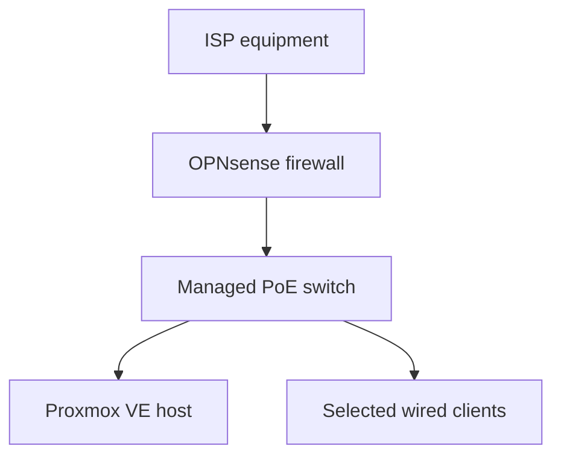

# OPNsense Deployment

> **Last verified:** August 2026  
> **Project status:** Operational base firewall; advanced network controls remain in progress

This document records the verified deployment of OPNsense on the dedicated HomeLab firewall appliance. It covers the initial installation, the base network path, essential connectivity tests, and the security controls that have already been applied.

The document intentionally omits real addresses, interface identifiers, internal names, credentials, recovery data, firewall exports, and other details that could expose the live environment.

## Deployment Summary

The dedicated Intel N100 appliance originally arrived with another firewall platform preinstalled. It was replaced with OPNsense using removable installation media, and the final system was installed on the appliance's internal storage.

After installation, the removable media was disconnected and the appliance was confirmed to boot independently from its internal drive. The initial WAN and LAN roles were then assigned and validated before selected devices were moved behind the new firewall path.

## Verified Progress

| Stage | Status | Verified result |
| --- | --- | --- |
| Installation media | **Completed** | OPNsense installation media was prepared and used successfully. |
| Internal installation | **Completed** | OPNsense was installed on the firewall appliance's internal storage. |
| Independent boot | **Verified** | The appliance boots without the removable installation media. |
| WAN role | **Operational** | The upstream interface obtains connectivity from the existing ISP equipment. |
| LAN role | **Operational** | A separate HomeLab LAN is active behind OPNsense. |
| DHCP service | **Operational base** | Kea DHCPv4 is enabled for the LAN and provides addresses to connected clients. Final documentation of individual reservations remains pending. |
| DNS resolution | **Verified** | DNS resolution was tested successfully from the HomeLab network. |
| Internet connectivity | **Verified** | A wired client reached the internet through OPNsense and the managed switch. |
| Local administration | **Verified** | The web administration interface is reachable from the approved local network. |
| Multi-factor authentication | **Enabled** | Time-based one-time-password authentication protects administrative access. |
| Configuration backup | **Created privately** | An initial configuration export was saved outside the public repository. |

## Current Network Path

The operational base path is:

This diagram represents the verified high-level path only. It does not disclose physical port numbers, interface identifiers, addresses, device names, or the exact domestic layout.

The managed switch is forwarding wired traffic in this path and can be administered through a stable private management configuration. Firmware compatibility has been reviewed. Future VLAN configuration remains a separate pending task.

## Initial Validation

The following checks were completed before treating the base path as operational:

1. Confirm that the firewall boots from internal storage.
2. Confirm that the upstream and internal network roles are assigned correctly.
3. Confirm that a LAN client receives valid network configuration.
4. Confirm local access to the OPNsense administration interface.
5. Confirm DNS resolution from a client behind the firewall.
6. Confirm internet connectivity through OPNsense and the switch.
7. Confirm that the Proxmox host remains reachable through the new network path.
8. Export an initial private configuration backup.

These checks validate the base network foundation. They do not mean that segmentation, remote access, switch backup and recovery, or service isolation has been completed.

## Security Controls Applied

The current deployment includes the following verified controls:

- Dedicated firewall hardware separates the HomeLab LAN from the upstream ISP network.
- Administrative access is performed from the approved local network.
- Multi-factor authentication is enabled for the OPNsense web interface.
- The initial configuration backup is stored privately and is excluded from Git.
- Public documentation uses descriptive labels instead of live infrastructure values.
- Changes are applied and tested incrementally before additional network features are introduced.

Future authentication improvements, such as hardware-backed or passkey-based access, remain under evaluation and are not described as deployed.

## Troubleshooting and Lessons Learned

Several practical checks were important during the deployment:

- Installation media must be removed only after the internal installation has completed successfully.
- A temporary lack of display output does not by itself prove that the firewall failed to boot; storage activity, console state, and network reachability should also be checked.
- WAN and LAN cable roles should be confirmed before changing interface assignments.
- Connectivity should be tested in layers: local interface access, client addressing, DNS resolution, and finally external access.
- Configuration changes should be applied in small groups so that the last known working state is easier to identify.
- A configuration export must be kept private because it may contain live infrastructure details and authentication material.

## Pending Work

The following items are not yet considered deployed or fully verified:

- Create a private managed-switch configuration backup and verify the recovery procedure.
- Confirm and document required DHCP reservations privately.
- Finalize cable organization and safe port labeling.
- Design VLANs based on device roles and trust levels.
- Apply inter-VLAN firewall rules only after segmentation has been tested safely.
- Design controlled remote access through a reviewed VPN solution.
- Evaluate stronger administrative authentication options.
- Define configuration-backup rotation and perform a recovery review.
- Add monitoring without exposing sensitive firewall or traffic information.

## Completion Boundary

OPNsense is correctly described as an **operational base firewall**. The wider network-foundation phase remains **in progress** until network segmentation, final cabling, recovery procedures, and the selected security improvements have been completed and documented.

## Information Intentionally Omitted

This public document does not include:

- Real public or private addresses and subnets
- Interface names, MAC addresses, or physical port assignments
- Internal DNS names, usernames, or management URLs
- Passwords, one-time-password seeds, recovery codes, or certificates
- Complete firewall, NAT, DHCP, DNS, or system configuration exports
- ISP details, Wi-Fi information, remote-access endpoints, or domestic layout data
- Unredacted screenshots, logs, backups, or diagnostic output

Sanitized evidence may be added later only after a full-resolution privacy review.
