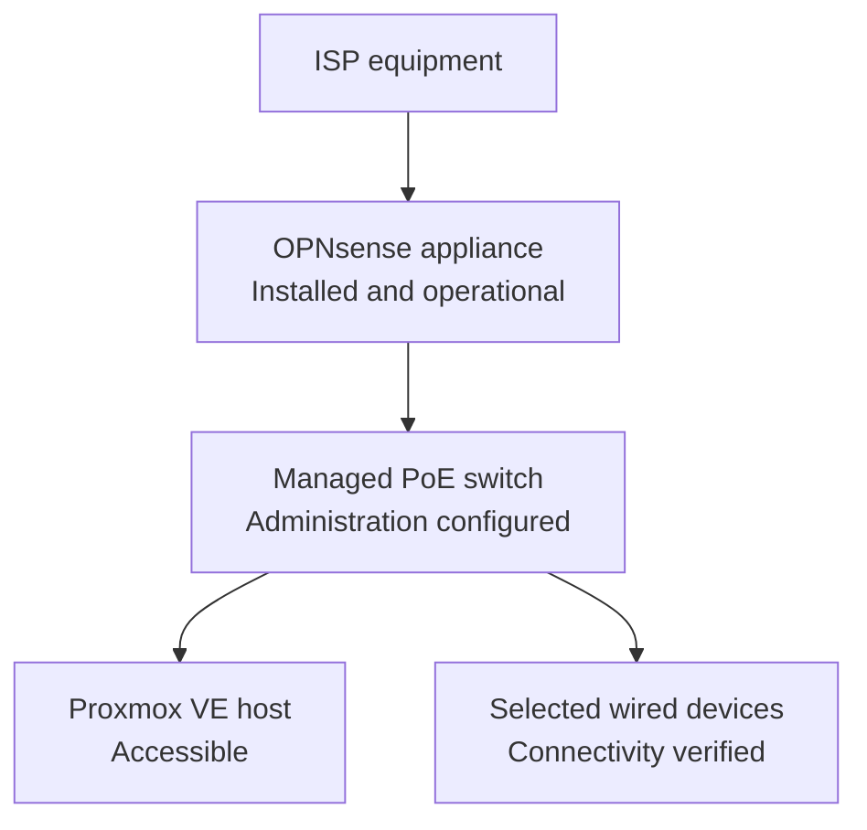
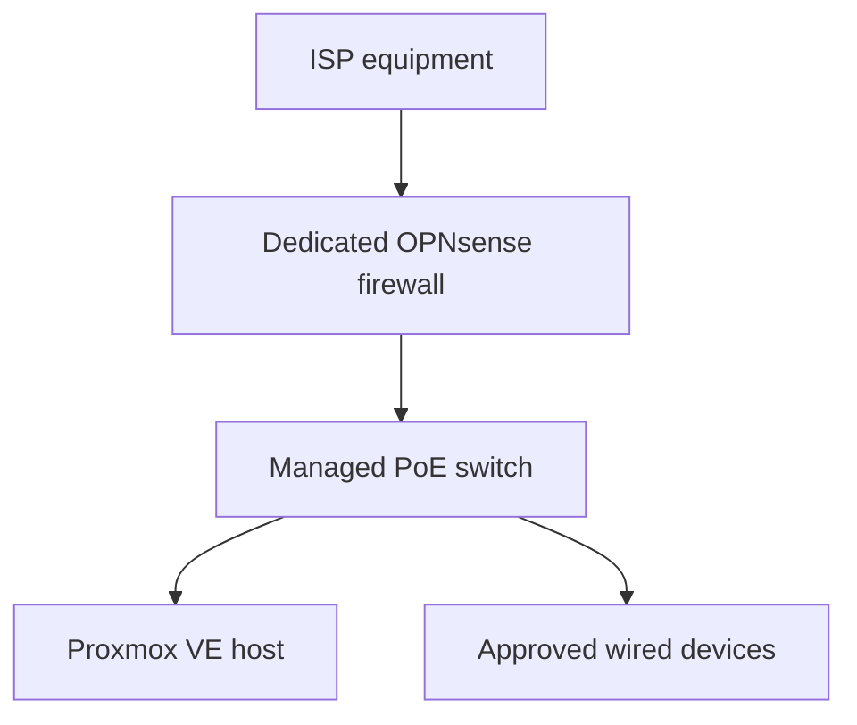

# Physical Setup

> **Last verified:** August 2026  
> **Project status:** Physical assembly completed; base network cabling operational; final organization in progress

This document describes the verified physical state of the HomeLab. It focuses on the rack, power, local administration, and current cabling progress without exposing the exact domestic layout or sensitive device information.

The rack has been assembled and the main rack components have been placed. The dedicated firewall, managed switch, Proxmox host, and selected wired clients now form an operational base network path. The rack remains open while cable routing, labeling, and power validation are completed. Exact rack-unit positions and domestic cable routes are intentionally not documented.

## Verified Physical State

| Area | Verified state | Notes |
| --- | --- | --- |
| Rack structure | **Assembled** | The 12U open-frame rack is built and being used as the central structure for the HomeLab. |
| Rack components | **Placed** | The patch panel, power distribution, shelf, and cable-management accessories are part of the current build. |
| Proxmox host | **Installed and accessible** | The virtualization host is connected through the HomeLab network path, and access to Proxmox VE has been verified. |
| Firewall appliance | **Installed and operational** | OPNsense is installed, the initial network roles are assigned, and connectivity through the appliance has been tested. |
| Managed switch | **Installed and managed** | The switch is forwarding traffic for selected devices, local administration is available through a stable private management configuration, and firmware compatibility has been reviewed. Network segmentation remains pending. |
| Network cabling | **Operational base; organization in progress** | The firewall-to-switch and selected device connections work. Final routing, labeling, and strain-relief checks remain pending. |
| Local console | **Available** | A portable display, compact keyboard, and HDMI KVM are available for local maintenance and diagnostics. |
| Power protection | **Available** | A UPS is available for selected HomeLab and network equipment. Formal load and runtime testing has not yet been documented. |

## Current Rack Components

The current physical build includes:

- A 12U open-frame rack
- A rack-mounted power distribution unit
- A 24-port Cat6 patch panel
- A rack shelf for non-rack-mount equipment
- A horizontal cable manager and brush panel
- The GMKtec Proxmox VE host
- The dedicated fanless firewall appliance
- The managed PoE switch
- A portable local-console display
- A shared HDMI KVM and compact keyboard for maintenance

This list confirms ownership and physical availability. The firewall, switch, and Proxmox host are connected for the verified base network, but this does not imply that every device or planned service is fully configured.

## Current Physical Connectivity

The upstream ISP equipment is connected to the dedicated OPNsense appliance. OPNsense feeds the managed switch, which provides wired connectivity to the Proxmox host and selected client devices. Address assignment, DNS resolution, internet connectivity, and local management access have been tested through this base path.

No public documentation will identify real wall outlets, room-to-room cable paths, port assignments, interface names, or the exact location of equipment inside the home.

## Base Cabling Milestone

The intended basic network path has been connected and validated:

The completed base work includes:

1. Install OPNsense on the dedicated appliance.
2. Identify the required upstream and internal network roles privately.
3. Connect the upstream and internal network links.
4. Connect the managed switch as the wired distribution point.
5. Connect the Proxmox host and selected wired devices.
6. Confirm local management, address assignment, DNS resolution, and internet access.
7. Save an initial OPNsense configuration backup privately.
8. Configure stable private switch management and verify local administrative access.
9. Review switch firmware compatibility without publishing live device details.

The remaining physical work is to organize and secure the final cabling, complete safe labeling, review ventilation and strain relief, and document the finished layout without exposing the home environment.

## Power and Local Administration

The rack includes power distribution and access to UPS-backed power for selected equipment. The final power allocation, measured load, expected runtime, and controlled-shutdown procedure have not yet been formally tested and therefore are not presented as completed.

Local maintenance can be performed with the portable display, keyboard, and KVM. This provides direct console access for installation and troubleshooting without relying entirely on remote management.

## Cable-Management Principles

The final physical layout will follow these principles:

- Keep power and network cables organized and easy to trace.
- Avoid unnecessary cable tension and tight bends.
- Leave enough service slack to maintain equipment safely.
- Use private labels that do not expose device or network details in public photographs.
- Keep ventilation paths clear around fanless and actively cooled equipment.
- Document changes only after the final connections have been tested.

## Publication-Safe Photography Checklist

Rack photographs may be added later, but every image must be reviewed before publication.

- Crop out unrelated parts of the home and identifying personal objects.
- Hide shipping labels, invoices, addresses, QR codes, barcodes, and serial-number stickers.
- Hide MAC addresses, device labels, Wi-Fi details, asset tags, and ISP information.
- Ensure that displays do not show IP addresses, hostnames, usernames, logs, browser tabs, or account details.
- Do not show handwritten passwords, recovery codes, network diagrams, or private notes.
- Avoid publishing a complete view that reveals the exact domestic layout or external cable entry points.
- Remove image metadata when appropriate before uploading.
- Review both the full image and zoomed-in details before committing it to the repository.

If an image cannot be sanitized confidently, it should not be published.

## Completion Criteria

The physical setup will be marked as complete only when:

- The firewall and switch are installed in their intended positions.
- Network and power connections are finalized.
- The new network path has been tested successfully.
- Cable routing and strain relief are complete.
- Ventilation and physical stability have been checked.
- A sanitized cabling overview can be documented without exposing the live environment.

Until those checks are complete, the correct public status remains **physical assembly completed; base network cabling operational; final organization in progress**.
