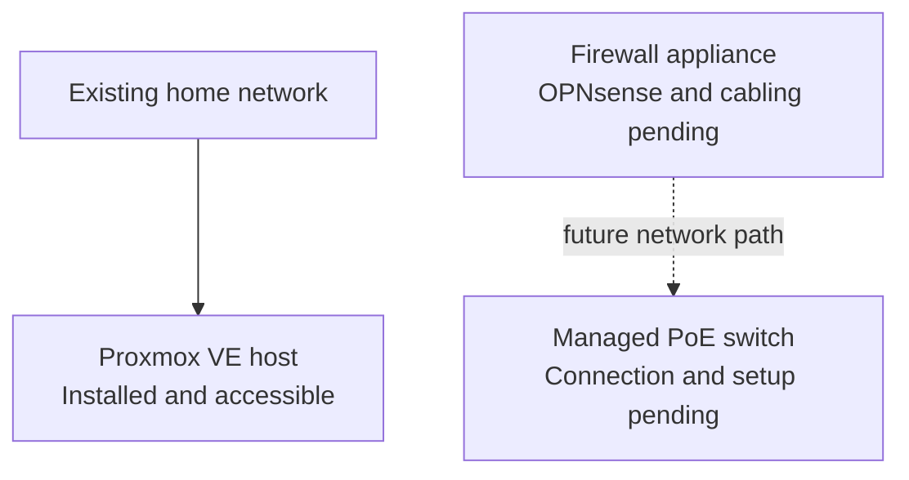
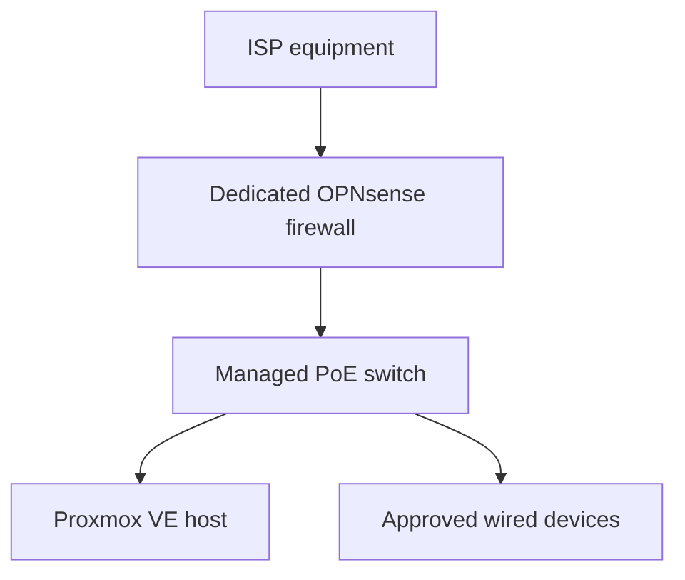

# Physical Setup

> **Last verified:** August 2026  
> **Project status:** Physical assembly completed; final network cabling in progress

This document describes the verified physical state of the HomeLab. It focuses on the rack, power, local administration, and current cabling progress without exposing the exact domestic layout or sensitive device information.

The rack has been assembled and the main rack components have been placed. It remains open while the dedicated firewall appliance and managed switch are prepared for the next deployment stage. Exact rack-unit positions and cable routes are not documented yet because the final layout has not been verified.

## Verified Physical State

| Area | Verified state | Notes |
| --- | --- | --- |
| Rack structure | **Assembled** | The 12U open-frame rack is built and being used as the central structure for the HomeLab. |
| Rack components | **Placed** | The patch panel, power distribution, shelf, and cable-management accessories are part of the current build. |
| Proxmox host | **Installed and accessible** | The virtualization host is physically available, Proxmox VE is installed, and access to its web interface has been verified. |
| Firewall appliance | **Awaiting deployment** | The device is available, but OPNsense installation, interface assignment, final placement, and production cabling are still pending. |
| Managed switch | **Awaiting deployment** | The switch is available but has not yet been connected or configured. |
| Final network cabling | **In progress** | The rack remains open while network connections and cable organization are completed. |
| Local console | **Available** | A portable display, compact keyboard, and HDMI KVM are available for local maintenance and diagnostics. |
| Power protection | **Available** | A UPS is available for selected HomeLab and network equipment. Formal load and runtime testing has not yet been documented. |

## Current Rack Components

The current physical build includes:

- A 12U open-frame rack
- A rack-mounted power distribution unit
- A 24-port Cat6 patch panel
- A rack shelf for non-rack-mount equipment
- A horizontal cable manager and brush panel
- The GMKtec Proxmox VE host
- The dedicated fanless firewall appliance
- The managed PoE switch
- A portable local-console display
- A shared HDMI KVM and compact keyboard for maintenance

This list confirms ownership and physical availability. It does not imply that every device is already powered, connected, configured, or operating in its intended production role.

## Current Physical Connectivity

The Proxmox host has already been connected sufficiently to install Proxmox VE and verify access to its management interface through the existing home network.

The planned firewall-to-switch path has **not** been deployed. The existing home network continues to provide normal connectivity while the new infrastructure is prepared.

No public documentation will identify real wall outlets, room-to-room cable paths, port assignments, interface names, or the exact location of equipment inside the home.

## Target Cabling Stage

The next physical milestone is to complete and validate the intended basic network path:

This remains a target design. It will only be marked as deployed after the following work has been completed and tested:

1. Install OPNsense on the dedicated appliance.
2. Identify and label the required interfaces privately.
3. Connect the intended upstream and internal network links.
4. Connect the managed switch.
5. Confirm management access without publishing real addresses.
6. Test normal connectivity before making the new path the primary network.
7. Organize and secure the final cabling.

## Power and Local Administration

The rack includes power distribution and access to UPS-backed power for selected equipment. The final power allocation, measured load, expected runtime, and controlled-shutdown procedure have not yet been formally tested and therefore are not presented as completed.

Local maintenance can be performed with the portable display, keyboard, and KVM. This provides direct console access for installation and troubleshooting without relying entirely on remote management.

## Cable-Management Principles

The final physical layout will follow these principles:

- Keep power and network cables organized and easy to trace.
- Avoid unnecessary cable tension and tight bends.
- Leave enough service slack to maintain equipment safely.
- Use private labels that do not expose device or network details in public photographs.
- Keep ventilation paths clear around fanless and actively cooled equipment.
- Document changes only after the final connections have been tested.

## Publication-Safe Photography Checklist

Rack photographs may be added later, but every image must be reviewed before publication.

- Crop out unrelated parts of the home and identifying personal objects.
- Hide shipping labels, invoices, addresses, QR codes, barcodes, and serial-number stickers.
- Hide MAC addresses, device labels, Wi-Fi details, asset tags, and ISP information.
- Ensure that displays do not show IP addresses, hostnames, usernames, logs, browser tabs, or account details.
- Do not show handwritten passwords, recovery codes, network diagrams, or private notes.
- Avoid publishing a complete view that reveals the exact domestic layout or external cable entry points.
- Remove image metadata when appropriate before uploading.
- Review both the full image and zoomed-in details before committing it to the repository.

If an image cannot be sanitized confidently, it should not be published.

## Completion Criteria

The physical setup will be marked as complete only when:

- The firewall and switch are installed in their intended positions.
- Network and power connections are finalized.
- The new network path has been tested successfully.
- Cable routing and strain relief are complete.
- Ventilation and physical stability have been checked.
- A sanitized cabling overview can be documented without exposing the live environment.

Until those checks are complete, the correct public status remains **physical assembly completed; final cabling and network deployment in progress**.
