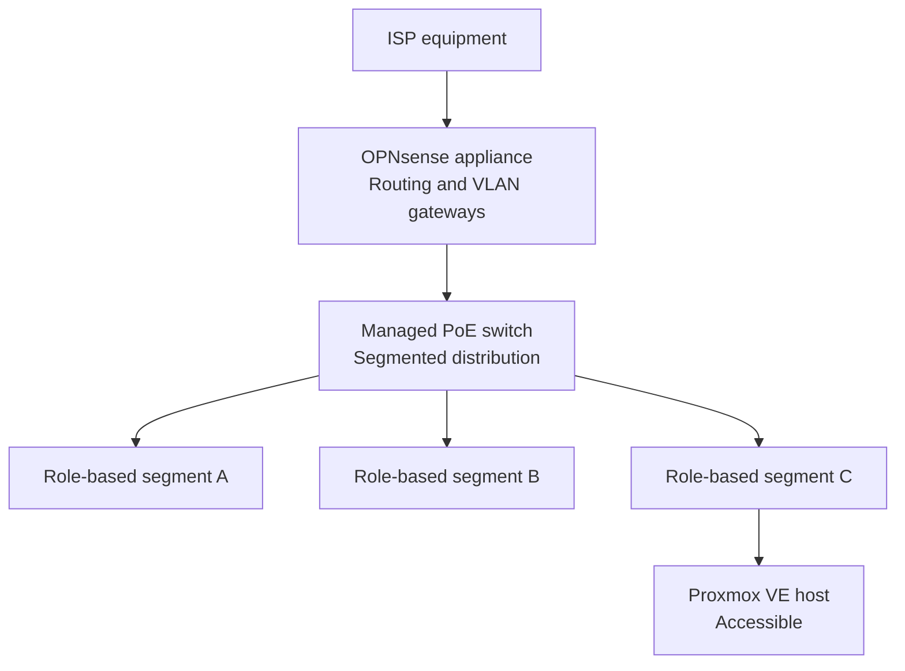
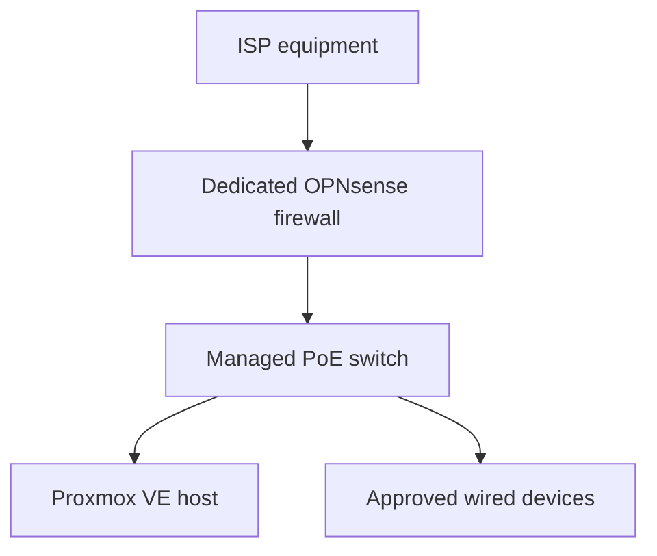

# Physical Setup

> **Last verified:** August 2026  
> **Project status:** Physical foundation completed and verified

This document describes the verified physical state of the HomeLab. It focuses on the completed rack, power, local administration, and cabling foundation without exposing the exact domestic layout or sensitive device information.

The rack has been assembled and the main rack components have been placed. The dedicated firewall, managed switch, Proxmox host, and selected wired clients form an operational segmented network path. Cable routing, private labeling, strain relief, ventilation, physical stability, power distribution, and the connected load have been reviewed and completed. Exact rack-unit positions and domestic cable routes are intentionally not documented.

## Verified Physical State

| Area | Verified state | Notes |
| --- | --- | --- |
| Rack structure | **Completed** | The 12U open-frame rack is built and used as the central structure for the HomeLab. |
| Rack components | **Installed** | The patch panel, power distribution, shelf, and cable-management accessories are installed in the current build. |
| Proxmox host | **Installed and accessible** | The virtualization host is connected through the HomeLab network path, and access to Proxmox VE has been verified. |
| Firewall appliance | **Installed and operational** | OPNsense `26.7.2_2` is installed, VLAN gateway operation is verified, and connectivity through the appliance has been tested. |
| Managed switch | **Installed, managed, and segmented** | Firmware `3.30.6`, private administration, traffic forwarding, and three role-based VLANs have been verified. |
| Network cabling | **Completed and verified** | The required connections, final routing, private labeling, organization, and strain-relief checks are complete. |
| Local console | **Available** | A portable display, compact keyboard, and HDMI KVM are available for local maintenance and diagnostics. |
| Power protection | **Installed and reviewed** | The UPS protects selected HomeLab equipment; power distribution and the connected load have been reviewed. Battery-runtime measurement and automated shutdown remain separate resilience work. |

## Current Rack Components

The current physical build includes:

- A 12U open-frame rack
- A rack-mounted power distribution unit
- A 24-port Cat6 patch panel
- A rack shelf for non-rack-mount equipment
- A horizontal cable manager and brush panel
- The GMKtec Proxmox VE host
- The dedicated fanless firewall appliance
- The managed PoE switch
- A portable local-console display
- A shared HDMI KVM and compact keyboard for maintenance

This list confirms ownership and physical availability. The firewall, switch, and Proxmox host are connected for the verified base network, but this does not imply that every device or planned service is fully configured.

## Current Physical Connectivity

The upstream ISP equipment is connected to the dedicated OPNsense appliance. OPNsense feeds the managed switch, which transports three role-based VLANs to approved wired devices. Proxmox reachability, DNS resolution, internet connectivity, and local management access have been tested after the segmented migration.

No public documentation will identify real wall outlets, room-to-room cable paths, port assignments, interface names, or the exact location of equipment inside the home.

## Base Cabling Milestone

The intended basic network path has been connected and validated:

The completed base work includes:

1. Install OPNsense on the dedicated appliance.
2. Identify the required upstream and internal network roles privately.
3. Connect the upstream and internal network links.
4. Connect the managed switch as the wired distribution point.
5. Connect the Proxmox host and selected wired devices.
6. Confirm local management, address assignment, DNS resolution, and internet access.
7. Save an initial OPNsense configuration backup privately.
8. Configure stable private switch management and verify local administrative access.
9. Review switch firmware compatibility without publishing live device details.
10. Complete the final cable routing and organization.
11. Apply private labeling and verify strain relief.
12. Review ventilation, physical stability, power distribution, and the connected load.

The physical foundation is complete. Future changes will be treated as maintenance or expansion work and documented without exposing the home environment.

## Power and Local Administration

The rack includes reviewed power distribution and UPS-backed power for selected equipment. The connected load has been reviewed as part of the completed physical foundation. Battery-runtime measurement and a controlled or automated shutdown procedure remain future resilience tasks and do not block physical completion.

Local maintenance can be performed with the portable display, keyboard, and KVM. This provides direct console access for installation and troubleshooting without relying entirely on remote management.

## Cable-Management Principles

The completed physical layout follows these principles and should continue to do so during maintenance:

- Keep power and network cables organized and easy to trace.
- Avoid unnecessary cable tension and tight bends.
- Leave enough service slack to maintain equipment safely.
- Use private labels that do not expose device or network details in public photographs.
- Keep ventilation paths clear around fanless and actively cooled equipment.
- Document changes only after the final connections have been tested.

## Publication-Safe Photography Checklist

Rack photographs may be added later, but every image must be reviewed before publication.

- Crop out unrelated parts of the home and identifying personal objects.
- Hide shipping labels, invoices, addresses, QR codes, barcodes, and serial-number stickers.
- Hide MAC addresses, device labels, Wi-Fi details, asset tags, and ISP information.
- Ensure that displays do not show IP addresses, hostnames, usernames, logs, browser tabs, or account details.
- Do not show handwritten passwords, recovery codes, network diagrams, or private notes.
- Avoid publishing a complete view that reveals the exact domestic layout or external cable entry points.
- Remove image metadata when appropriate before uploading.
- Review both the full image and zoomed-in details before committing it to the repository.

If an image cannot be sanitized confidently, it should not be published.

## Completion Criteria

The physical setup is marked as complete because:

- [x] The firewall and switch are installed in their intended positions.
- [x] Network and power connections are finalized.
- [x] The new network path has been tested successfully.
- [x] Cable routing, organization, private labeling, and strain relief are complete.
- [x] Ventilation and physical stability have been checked.
- [x] Power distribution and the connected load have been reviewed.
- [x] The completed state can be documented without exposing the live environment.

The correct public status is **physical foundation completed and verified**. Public photographs remain optional and must pass the privacy checklist before publication.
