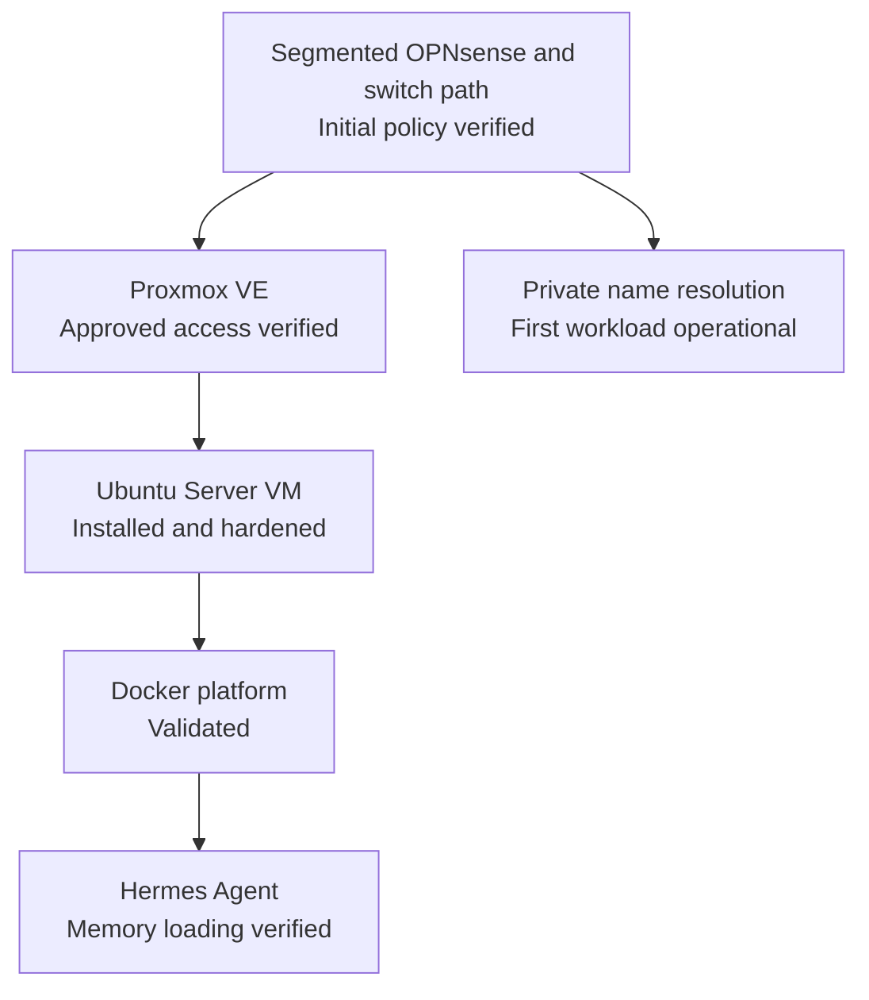

# Proxmox VE Installation

> **Last verified:** September 2026  
> **Project status:** Proxmox VE `9.2.11` operational with the first validated Linux service VM

This document records the verified progress of the Proxmox VE deployment used as the virtualization foundation of the HomeLab. It intentionally separates completed work from unfinished tasks and excludes sensitive information about the live environment.

## Deployment Summary

Proxmox VE has been installed on the GMKtec NucBox M6 Ultra designated as the main virtualization host. The host has been updated to Proxmox VE `9.2.11` with kernel `7.0.14-14-pve`, the package source appropriate for a non-subscribed lab environment has been enabled, and access to the web interface has been verified through the operational segmented OPNsense and managed-switch path. A private configuration copy was preserved before the host update.

Stable local management addressing and name resolution are configured privately. The host has been migrated to its intended segmented management path and remained reachable from an approved client segment after VLAN, firewall, switch-firmware, internet, and DNS validation. A separate administrative account with multi-factor authentication is available for normal web administration. An operating system ISO has also been uploaded to Proxmox storage.

The first service VM is now operational. Ubuntu Server `24.04.4 LTS` was installed, updated, connected through its approved segmented service path, and verified with private name resolution. Remote administration uses a dedicated non-root account and an encrypted ED25519 key. Password-based SSH authentication and direct root login are disabled.

Docker Engine `29.7.2` and Docker Compose `5.5.0` were installed from the maintained upstream repository. The Docker service, container runtime, and a test container were validated before Hermes Agent was deployed. Hermes is operational, and automatic loading of its persistent user memory has been confirmed in a new session.

Initial compressed backups of the current virtual machine and container workloads have now been created. Encrypted copies were transferred to separate storage, and matching SHA-256 checksums verified the integrity of each transfer. After further configuration changes, the virtual-machine procedure was executed again: a new archive was created, encrypted, transferred away from the virtualization host, and verified against its encrypted source. Unencrypted working archives remain protected temporarily on the host while cleanup and retention handling are finalized. A controlled restoration test has not yet been completed.

## Verified Progress

| Stage | Status | Verified result |
| --- | --- | --- |
| Physical host prepared | **Completed** | The designated mini PC is available and used as the Proxmox host. |
| Proxmox VE installation | **Completed** | Proxmox VE has been installed successfully. |
| System updates | **Completed** | Proxmox VE `9.2.11` and kernel `7.0.14-14-pve` are installed. |
| Package source | **Configured** | The repository appropriate for a non-subscribed HomeLab environment is enabled. |
| Management networking | **Segmented and verified** | Stable private management connectivity and local name resolution were migrated to the intended segmented path. |
| Management interface access | **Verified after migration** | The web administration interface remains reachable through the segmented OPNsense and managed-switch path from an approved client segment. |
| Administrative account | **Configured** | A separate account is used for normal administrative access. |
| Multi-factor authentication | **Enabled** | Time-based one-time-password authentication protects the administrative account. |
| Installation media upload | **Completed** | An operating system ISO has been uploaded to Proxmox storage. |
| First-workload network foundation | **Operational and verified** | Required network policy and private name resolution support the first service workload without publishing live values. |
| Initial VM creation | **Completed** | The first service VM was created, booted, restarted, and validated. |
| Guest operating system installation | **Completed** | Ubuntu Server `24.04.4 LTS` is installed, updated, and reachable through its approved path. |
| Guest administration | **Hardened and verified** | Key-based access through a dedicated non-root account is operational; password authentication and direct root login are disabled. |
| Container platform | **Operational** | Docker Engine `29.7.2`, Docker Compose `5.5.0`, and a test container were validated. |
| First service workload | **Operational** | Hermes Agent is deployed, and persistent memory loading has been verified across sessions. |
| Backup and restore testing | **Initial baseline and follow-up VM backup verified; restoration pending** | A private pre-update host-configuration copy and encrypted initial VM and container backups exist. The manual virtual-machine workflow was later repeated after further changes, and its secondary copy passed SHA-256 comparison. Recurring rotation and controlled restoration remain pending. |
| Monitoring and alerting | **Planned** | Prometheus, Grafana, and related monitoring remain future work. |

## Current Role in the HomeLab

The Proxmox host now provides the active virtualization layer for the first isolated service workload. Its verified responsibilities include:

- Running the first maintained Linux server VM
- Hosting the validated Docker and Hermes Agent platform
- Providing approved, segmented administration and service connectivity

Future responsibilities include:

- Additional Linux virtual machines and container-hosting environments
- Home Assistant and local automation services
- Monitoring and observability services
- Controlled cybersecurity and systems-administration practice environments

Only the first Linux VM, Docker platform, and Hermes Agent service are currently deployed. The other uses remain planned.

## Current Logical State

The host is connected through the operational segmented OPNsense and managed-switch path. Its approved administration path, internet access, and DNS resolution were checked after migration. Selected cross-segment isolation was also verified, and private name resolution is operational for the first service workload. Live addressing, VLAN membership, VM identifiers, bridge values, DNS records, and interface details remain private.

## Information Intentionally Omitted

The public documentation does not include:

- The real management IP address or web-interface URL
- The internal hostname, domain, node name, or storage identifiers
- Usernames, passwords, authentication codes, or recovery information
- Network-interface identifiers, MAC addresses, or real bridge configuration
- Serial numbers, subscription identifiers, or device labels
- Screenshots containing browser, account, network, or household information
- Unredacted logs, configuration exports, backups, or cluster credentials

Future examples will use placeholders or documentation-only values. Sanitized examples must never be copied directly into the live environment without review.

## Evidence Suitable for a Public Portfolio

The following evidence may be added after it has been carefully sanitized:

- A cropped view confirming that the Proxmox interface is reachable
- A storage view showing that installation media is available
- A VM summary showing only sanitized names and states
- A short explanation of decisions such as resource allocation and network isolation
- Troubleshooting notes that do not disclose real addresses, identifiers, or access details

Before publication, screenshots must be checked at full resolution. Hostnames, addresses, usernames, browser tabs, task logs, storage names, timestamps that reveal routines, and unrelated personal information must be removed or obscured.

## Next Milestone: Repeatable Recovery

The first Linux VM and service workload are complete. Initial encrypted VM and container backups have been copied to separate storage and integrity-verified, and the protected virtual-machine workflow has since been repeated manually. The next reliability milestone is an automated and recoverable procedure. It will only be marked as completed after all of the following have been confirmed:

1. Finalize cleanup or retention handling for unencrypted working archives.
2. Establish a recurring backup schedule and retention policy.
3. Add capacity and backup-failure monitoring.
4. Perform a controlled restoration test in an isolated context.
5. Confirm that a restored guest or container starts and behaves as expected.
6. Confirm restored Hermes Agent availability and persistent-memory behavior where applicable.
7. Document the sanitized recovery procedure and its limitations.

Until these checks are complete, the public project status remains **initial encrypted workload baseline and follow-up manual virtual-machine backup verified; recurring rotation and controlled restoration pending**.

## Future Documentation

As the environment develops, this section may be expanded with separate documents covering:

- Hermes Agent deployment
- [Backup and recovery](backup-and-recovery.md)
- Proxmox storage decisions
- Sanitized network-bridge design
- Update and maintenance routines
- Resource monitoring and capacity planning
- Service placement across VMs and containers

Each update will distinguish verified implementation from planned work and will be reviewed for privacy before publication.
