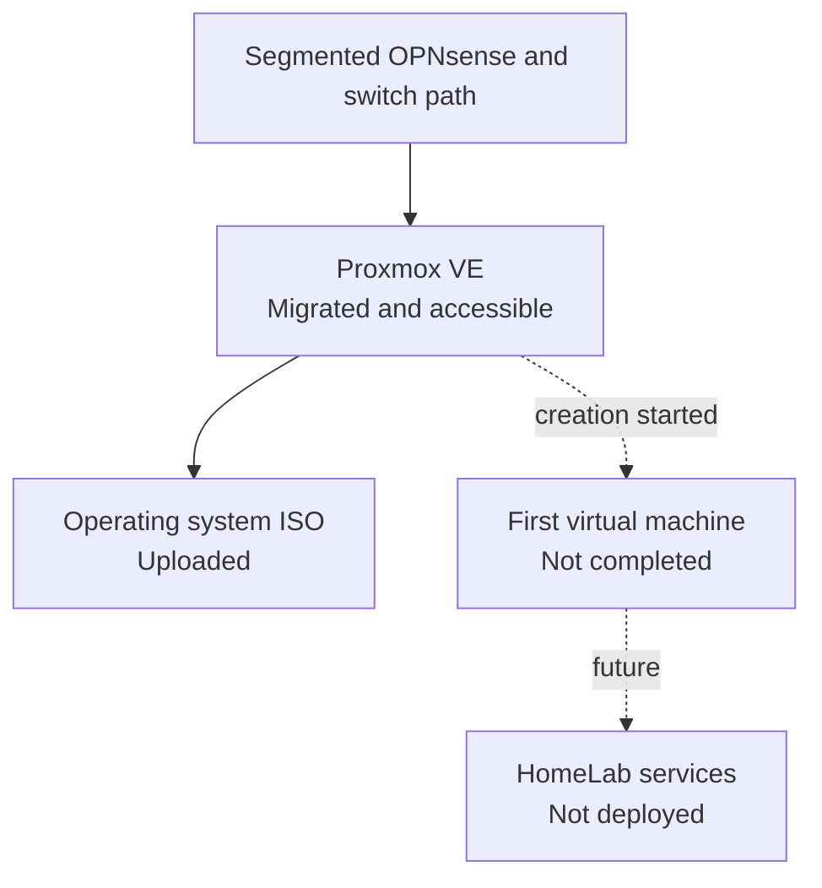

# Proxmox VE Installation

> **Last verified:** August 2026  
> **Project status:** Proxmox VE installed, updated, segmented, and hardened; no completed virtual machines yet

This document records the verified progress of the Proxmox VE deployment used as the virtualization foundation of the HomeLab. It intentionally separates completed work from unfinished tasks and excludes sensitive information about the live environment.

## Deployment Summary

Proxmox VE has been installed on the GMKtec NucBox M6 Ultra designated as the main virtualization host. The host has been updated, the package source appropriate for a non-subscribed lab environment has been enabled, and access to the web interface has been verified through the operational segmented OPNsense and managed-switch path.

Stable local management addressing and name resolution are configured privately. The host has been migrated to its intended segmented management path and remained reachable after VLAN, firewall, switch-firmware, internet, and DNS validation. A separate administrative account with multi-factor authentication is available for normal web administration. An operating system ISO has also been uploaded to Proxmox storage.

Initial virtual-machine creation was started, but no virtual machine has been fully created, booted, configured, or validated. The current deployment must therefore not be described as hosting operational workloads.

## Verified Progress

| Stage | Status | Verified result |
| --- | --- | --- |
| Physical host prepared | **Completed** | The designated mini PC is available and used as the Proxmox host. |
| Proxmox VE installation | **Completed** | Proxmox VE has been installed successfully. |
| System updates | **Completed** | Available host updates were applied after installation. |
| Package source | **Configured** | The repository appropriate for a non-subscribed HomeLab environment is enabled. |
| Management networking | **Segmented and verified** | Stable private management connectivity and local name resolution were migrated to the intended segmented path. |
| Management interface access | **Verified after migration** | The web administration interface remains reachable through the segmented OPNsense and managed-switch path. |
| Administrative account | **Configured** | A separate account is used for normal administrative access. |
| Multi-factor authentication | **Enabled** | Time-based one-time-password authentication protects the administrative account. |
| Installation media upload | **Completed** | An operating system ISO has been uploaded to Proxmox storage. |
| Initial VM creation | **Started, not completed** | The creation workflow was opened, but no complete VM has been deployed or booted. |
| Guest operating system installation | **Not started** | No guest operating system installation has been completed. |
| Production workloads | **Not deployed** | No HomeLab service currently depends on a Proxmox guest. |
| Backup and restore testing | **Not configured** | No verified VM backup or restore procedure has been documented yet. |
| Monitoring and alerting | **Planned** | Prometheus, Grafana, and related monitoring remain future work. |

## Current Role in the HomeLab

At this stage, the Proxmox host provides the base platform for future isolated workloads. Its planned responsibilities include:

- Linux virtual machines for infrastructure services
- Container-hosting environments
- Home Assistant and local automation services
- Monitoring and observability services
- Supporting services for the planned local AI-assistant architecture
- Controlled cybersecurity and systems-administration practice environments

These are target uses only. They must not be interpreted as currently deployed services.

## Current Logical State

The host is connected through the operational segmented OPNsense and managed-switch path. Its reachability, internet access, and DNS resolution were checked after migration. Live addressing, VLAN membership, bridge values, and interface details remain private. Dedicated guest and service networks will be documented only after workloads are deployed and verified.

## Information Intentionally Omitted

The public documentation does not include:

- The real management IP address or web-interface URL
- The internal hostname, domain, node name, or storage identifiers
- Usernames, passwords, authentication codes, or recovery information
- Network-interface identifiers, MAC addresses, or real bridge configuration
- Serial numbers, subscription identifiers, or device labels
- Screenshots containing browser, account, network, or household information
- Unredacted logs, configuration exports, backups, or cluster credentials

Future examples will use placeholders or documentation-only values. Sanitized examples must never be copied directly into the live environment without review.

## Evidence Suitable for a Public Portfolio

The following evidence may be added after it has been carefully sanitized:

- A cropped view confirming that the Proxmox interface is reachable
- A storage view showing that installation media is available
- A future VM summary showing only non-sensitive demonstration names and states
- A short explanation of decisions such as resource allocation and network isolation
- Troubleshooting notes that do not disclose real addresses, identifiers, or access details

Before publication, screenshots must be checked at full resolution. Hostnames, addresses, usernames, browser tabs, task logs, storage names, timestamps that reveal routines, and unrelated personal information must be removed or obscured.

## Next Milestone: First Linux Virtual Machine

The next verified milestone will be the creation of the first Linux VM. It will only be marked as completed after all of the following have been confirmed:

1. Define an appropriate and documented purpose for the VM.
2. Select CPU, memory, storage, and firmware settings based on that purpose.
3. Complete the guest operating system installation.
4. Boot the VM successfully after installation.
5. Confirm local management access without publishing real connection details.
6. Apply operating system updates and basic security settings.
7. Record the sanitized configuration and the reasoning behind the resource choices.
8. Test a safe shutdown and restart.
9. Create and verify an initial backup before the VM hosts important services.

Until these checks are complete, the public project status remains **Proxmox VE installed, updated, segmented, and hardened; no completed virtual machines**.

## Future Documentation

As the environment develops, this section may be expanded with separate documents covering:

- First Linux VM deployment
- Proxmox storage decisions
- Sanitized network-bridge design
- Backup and recovery procedures
- Update and maintenance routines
- Resource monitoring and capacity planning
- Service placement across VMs and containers

Each update will distinguish verified implementation from planned work and will be reviewed for privacy before publication.
