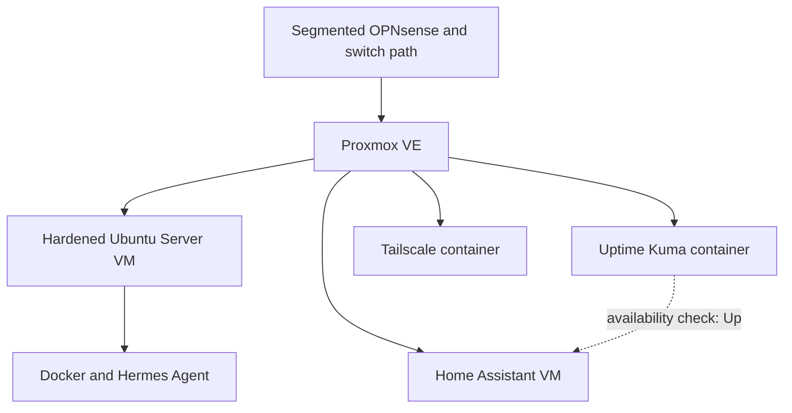

# Proxmox VE Installation

> **Last verified:** September 2026  
> **Project status:** Proxmox VE `9.2.11` operational with assistant, home-automation, monitoring, and remote-access workloads

This document records the verified progress of the Proxmox VE deployment used as the virtualization foundation of the HomeLab. It intentionally separates completed work from unfinished tasks and excludes sensitive information about the live environment.

## Deployment Summary

Proxmox VE has been installed on the GMKtec NucBox M6 Ultra designated as the main virtualization host. The host has been updated to Proxmox VE `9.2.11` with kernel `7.0.14-14-pve`, the package source appropriate for a non-subscribed lab environment has been enabled, and access to the web interface has been verified through the operational segmented OPNsense and managed-switch path. A private configuration copy was preserved before the host update.

Stable local management addressing and name resolution are configured privately. The host has been migrated to its intended segmented management path and remained reachable from an approved client segment after VLAN, firewall, switch-firmware, internet, and DNS validation. A separate administrative account with multi-factor authentication is available for normal web administration. An operating system ISO has also been uploaded to Proxmox storage.

The first service VM is now operational. Ubuntu Server `24.04.4 LTS` was installed, updated, connected through its approved segmented service path, and verified with private name resolution. Remote administration uses a dedicated non-root account and an encrypted ED25519 key. Password-based SSH authentication and direct root login are disabled.

Docker Engine `29.7.2` and Docker Compose `5.5.0` were installed from the maintained upstream repository. The Docker service, container runtime, and a test container were validated before Hermes Agent was deployed. Hermes is operational, and automatic loading of its persistent user memory has been confirmed in a new session.

Home Assistant now runs in a separate VM. Private name resolution is verified, and companion apps on selected mobile devices are connected. Uptime Kuma runs as a separate container workload with initial alerting configured; its Home Assistant monitor was saved and reported **Up**. A dedicated Tailscale container is also present in the workload inventory. The selected travel laptop has passed an external access test to the Hermes host through a mobile hotspot; this does not establish unrestricted remote Proxmox administration or verified subnet routing.

Initial compressed VM and container backups were created and encrypted copies transferred to separate storage, with matching SHA-256 checksums verifying transfer integrity. After further configuration changes, the manual VM procedure was repeated with another encrypted and integrity-checked secondary copy. Cleanup and retention handling for unencrypted working archives remain to be finalized. These earlier backup records do not establish coverage of every workload added since then.

A separate Home Assistant application backup has now been exported, its archive contents inspected, and a copy placed on external storage. This application export is distinct from a Proxmox VM backup. The earlier encryption and checksum results do not establish those checks for the new application export. Controlled restoration of the documented backups remains pending.

## Verified Progress

| Stage | Status | Verified result |
| --- | --- | --- |
| Physical host prepared | **Completed** | The designated mini PC is available and used as the Proxmox host. |
| Proxmox VE installation | **Completed** | Proxmox VE has been installed successfully. |
| System updates | **Completed** | Proxmox VE `9.2.11` and kernel `7.0.14-14-pve` are installed. |
| Package source | **Configured** | The repository appropriate for a non-subscribed HomeLab environment is enabled. |
| Management networking | **Segmented and verified** | Stable private management connectivity and local name resolution were migrated to the intended segmented path. |
| Management interface access | **Verified after migration** | The web administration interface remains reachable through the segmented OPNsense and managed-switch path from an approved client segment. |
| Administrative account | **Configured** | A separate account is used for normal administrative access. |
| Multi-factor authentication | **Enabled** | Time-based one-time-password authentication protects the administrative account. |
| Installation media upload | **Completed** | An operating system ISO has been uploaded to Proxmox storage. |
| First-workload network foundation | **Operational and verified** | Required network policy and private name resolution support the first service workload without publishing live values. |
| Initial VM creation | **Completed** | The first service VM was created, booted, restarted, and validated. |
| Guest operating system installation | **Completed** | Ubuntu Server `24.04.4 LTS` is installed, updated, and reachable through its approved path. |
| Guest administration | **Hardened and verified** | Key-based access through a dedicated non-root account is operational; password authentication and direct root login are disabled. |
| Container platform | **Operational** | Docker Engine `29.7.2`, Docker Compose `5.5.0`, and a test container were validated. |
| First service workload | **Operational** | Hermes Agent is deployed, and persistent memory loading has been verified across sessions. |
| Home Assistant guest | **Operational** | A separate VM hosts Home Assistant with verified private name resolution and connected mobile companion apps. Voice setup and Hermes integration remain unfinished. |
| Additional container workloads | **Present** | Separate containers host Uptime Kuma and Tailscale. Placement alone does not establish every intended monitoring or remote-routing function. |
| Backup and restore testing | **Earlier integrity checks verified; restoration pending** | A private pre-update host-configuration copy and encrypted initial VM and container backups exist. The later manual VM backup also passed secondary-copy SHA-256 comparison. Recurring rotation and controlled restoration remain pending. |
| Home Assistant application backup | **Exported and copied** | Archive contents were inspected and a copy placed on external storage. This is a separate application-level backup; its encryption and checksum checks are not established here. |
| Monitoring and alerting | **Initial deployment operational** | Uptime Kuma and initial alerting are configured. The Home Assistant availability monitor reported **Up**. Full host and guest coverage, per-monitor notification validation, Prometheus, and Grafana remain future work. |

## Current Role in the HomeLab

The Proxmox host provides the virtualization layer for several workloads. Its current responsibilities include:

- Running the first maintained Linux server VM
- Hosting the validated Docker and Hermes Agent platform
- Running Home Assistant in a separate virtual machine
- Hosting separate Uptime Kuma and Tailscale containers
- Providing approved, segmented administration and service connectivity

Future responsibilities include:

- Additional Linux virtual machines and container-hosting environments
- Further local automation services and approved assistant integrations
- Broader monitoring, metrics, and capacity observability
- Controlled cybersecurity and systems-administration practice environments

The assistant guest, Home Assistant, and Uptime Kuma are operational. The dedicated Tailscale container is recorded separately from the externally tested host-access path. n8n, Prometheus, Grafana, complete voice operation, and Hermes-to-Home-Assistant integration are not documented as complete. Separate VM and container placement does not by itself prove workload isolation or independent recovery capability.

## Current Logical State

```mermaid
flowchart TD
    NET["Segmented OPNsense and switch path"] --> PVE["Proxmox VE"]
    PVE --> VM["Hardened Ubuntu Server VM"]
    VM --> DOCKER["Docker and Hermes Agent"]
    PVE --> HA["Home Assistant VM"]
    PVE --> KUMA["Uptime Kuma container"]
    PVE --> TS["Tailscale container"]
    KUMA -. "availability check: Up" .-> HA
```

The diagram shows workload placement and the observed monitoring relationship, rather than firewall permissions. The host is connected through the operational segmented OPNsense and managed-switch path. Its approved administration path, internet access, and DNS resolution were checked after migration. Selected cross-segment isolation was also verified, and private name resolution is operational for the assistant guest and Home Assistant. Live addressing, VLAN membership, guest identifiers, bridge values, DNS records, and interface details remain private.

## Information Intentionally Omitted

The public documentation does not include:

- The real management IP address or web-interface URL
- The internal hostname, domain, node name, or storage identifiers
- Usernames, passwords, authentication codes, or recovery information
- Network-interface identifiers, MAC addresses, or real bridge configuration
- Serial numbers, subscription identifiers, or device labels
- Screenshots containing browser, account, network, or household information
- Unredacted logs, configuration exports, backups, or cluster credentials

Future examples will use placeholders or documentation-only values. Sanitized examples must never be copied directly into the live environment without review.

## Evidence Suitable for a Public Portfolio

The following evidence may be added after it has been carefully sanitized:

- A cropped view confirming that the Proxmox interface is reachable
- A storage view showing that installation media is available
- A VM summary showing only sanitized names and states
- A short explanation of decisions such as resource allocation and network isolation
- Troubleshooting notes that do not disclose real addresses, identifiers, or access details

Before publication, screenshots must be checked at full resolution. Hostnames, addresses, usernames, browser tabs, task logs, storage names, timestamps that reveal routines, and unrelated personal information must be removed or obscured.

## Next Milestone: Repeatable Recovery

The host now runs multiple service workloads. Earlier encrypted VM and container backups passed secondary-copy integrity checks, the manual VM workflow was repeated, and a Home Assistant application export has been copied to external storage. The next reliability milestone is a documented, repeatable recovery procedure with recurring backup coverage for the current workload inventory. It will only be marked as completed after all of the following have been confirmed:

1. Map each current VM, container, and application to its required backup scope and recovery dependencies.
2. Document protection and integrity checks for the new Home Assistant application-backup copy.
3. Finalize cleanup or retention handling for unencrypted working archives.
4. Establish a recurring backup schedule and retention policy.
5. Add capacity and backup-failure monitoring; an **Up** availability check does not validate backup health.
6. Perform controlled restoration tests in an isolated context.
7. Confirm that restored guests and containers start and their services behave as expected.
8. Confirm restored Hermes memory behavior and Home Assistant application recovery where applicable.
9. Document the sanitized recovery procedure and its limitations.

Until these checks are complete, the recovery status remains **earlier encrypted backup integrity checks verified and Home Assistant application export copied; recurring rotation and controlled restoration pending**.

## Future Documentation

As the environment develops, this section may be expanded with separate documents covering:

- [Hermes Agent deployment](hermes-agent-deployment.md) updates
- [Backup and recovery](backup-and-recovery.md)
- Proxmox storage decisions
- Sanitized network-bridge design
- Update and maintenance routines
- Resource monitoring and capacity planning
- Service placement across VMs and containers

Each update will distinguish verified implementation from planned work and will be reviewed for privacy before publication.
