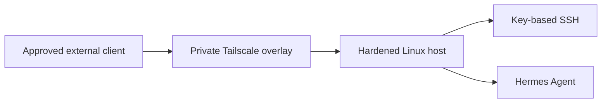

# Tailscale Remote Access

> **Last verified:** September 2026  
> **Project status:** Initial private remote-access path operational and externally tested

This document records the first verified remote-access deployment for the HomeLab. Tailscale provides a private encrypted path between an approved client and the Linux host running Hermes Agent. The deployment was tested from outside the home network without publishing a public inbound service.

The document intentionally omits device names, account identities, addresses, DNS names, authentication data, keys, access-policy details, and screenshots of the live tailnet.

## Deployment Summary

Tailscale is installed and connected on the Hermes Linux host and an approved client device. The client can reach the host through the private overlay while away from the local HomeLab network.

Remote administration continues to use the guest's existing hardened OpenSSH configuration. Tailscale provides the network path; SSH still requires the approved encrypted key. Password-based SSH authentication and direct root login remain disabled.

The external test confirmed that the approved client could establish the private path and connect to the Hermes host after leaving the home network. No router port forwarding or directly exposed public SSH endpoint was required.

## Verified Progress

| Stage | Status | Verified result |
| --- | --- | --- |
| Hermes host enrollment | **Completed** | The Linux service host is connected to the private Tailscale network. |
| Approved client enrollment | **Completed** | One authorized client is connected and can use the private path. |
| Device identification | **Reviewed** | The participating device entry was given a recognizable private label and checked in the administration view. |
| Private reachability | **Verified** | The approved client can reach the Hermes host through Tailscale. |
| SSH authentication | **Verified** | The existing encrypted SSH key works through the private overlay; password login and direct root login remain disabled. |
| External-network test | **Completed** | Access was tested successfully while the client was outside the local home network. |
| Public port exposure | **Not required** | The verified path does not depend on publishing the SSH service through router port forwarding. |
| Additional travel devices | **Pending** | The travel laptop and selected backup client devices have not yet completed the same validation. |
| Exit Node and subnet routing | **Not deployed** | General internet egress through the HomeLab and broad access to internal subnets are outside the current verified scope. |
| Access-policy refinement | **Pending** | Device lifecycle, least-privilege policy, recovery, and future user separation still require review. |

## Current Access Path

This diagram shows only the verified high-level path. It does not disclose the client's identity, the host's public or private addressing, the tailnet name, or any live access-control values.

## Security Boundary

The current design applies these controls:

- Remote access is limited to explicitly enrolled devices.
- Tailscale provides an encrypted private overlay rather than a directly exposed inbound router port.
- SSH retains independent key-based authentication.
- The SSH private key remains encrypted and outside the public repository.
- Password-based SSH authentication is disabled.
- Direct root login is disabled.
- Live device identities, addresses, account information, and policy details remain private.

This deployment proves access to one service host. It does not grant or document unrestricted remote access to Proxmox, OPNsense, the managed switch, every VLAN, or other household devices.

## External Validation

The initial validation followed this sequence:

1. Confirm local SSH access before changing the remote path.
2. Connect the Hermes host to Tailscale.
3. Connect and identify the approved client.
4. Confirm private overlay reachability.
5. Leave the local home network.
6. Reconnect to the Hermes host through Tailscale.
7. Confirm that the existing SSH key is still required and accepted.
8. Confirm that Hermes remains reachable through the validated host.

Passing this test establishes a working external path. It does not replace periodic device review, recovery testing, monitoring, or testing from every device intended for travel.

## Remaining Work

- Install and validate Tailscale on the travel laptop before the Japan trip.
- Test access again through an independent external network or mobile hotspot.
- Prepare selected phone, tablet, or secondary-computer access only where useful.
- Review least-privilege access controls and device approval rules.
- Define device removal, key rotation, lost-device, and account-recovery procedures.
- Add monitoring for unexpected disconnection or loss of remote reachability.
- Decide separately whether subnet routing or an Exit Node is needed.
- Define restricted identities and service-only permissions before granting family access.

## Information Intentionally Omitted

This public document does not include:

- Tailscale or local IP addresses.
- Tailnet, machine, host, account, or user names.
- Device identifiers, node keys, authentication keys, tags, or key-expiration values.
- SSH usernames, public keys, private keys, fingerprints, aliases, or local configuration paths.
- Access-control policy, grants, groups, routes, DNS configuration, or administrative screenshots.
- Public endpoints, connection logs, session history, or location information.

These boundaries demonstrate a tested remote-access design without disclosing the live access path.
